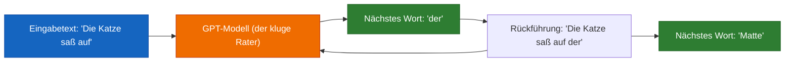
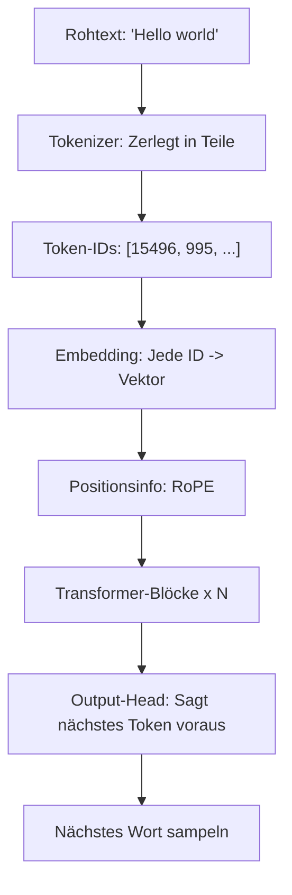

# Kapitel 0 — Was ist eigentlich ein GPT?

> *"Wenn du es einem Fünfjährigen erklären kannst, hast du es wirklich verstanden."*

---

## Die Analogie für Fünfjährige

Stell dir vor, du hast einen Freund, der **jedes Buch in der Bibliothek** gelesen hat. Du beginnst einen Satz:

> *"Die Katze saß auf der..."*

Dein Freund, der so viele Bücher gelesen hat, **rät** das nächste Wort: **"Matte"**.

Genau das ist ein GPT: **eine Maschine, die riesige Mengen Text liest und lernt, das nächste Wort zu erraten.**

| Konzept | Analogie |
|---|---|
| **GPT** | Ein sehr kluger "Nächstes-Wort-Rater" |
| **Training** | Millionen Bücher lesen, um Muster zu lernen |
| **Textgenerierung** | Unendlich "vervollständige meinen Satz" spielen |
| **Parameter** | Das "Gedächtnis" all der gelernten Muster |
| **Attention** | Wissen, welche Wörter am wichtigsten sind |

## Das große Bild: Pipeline-Überblick

## Auf welchen Modellen basiert das hier?

**Kurze Antwort: Das hier ist ein moderner decoder-only Transformer (im LLaMA-Stil), der die besten öffentlich dokumentierten Techniken aus den Jahren 2023–2025 vereint.**

## Was du bauen wirst

Am Ende dieses Guides wirst du Folgendes von Grund auf gebaut haben:

| Komponente | Was sie macht | Kapitel |
|---|---|---|
| **Tokenizer** | Wandelt Text ↔ Zahlen um (BPE, derselbe Algorithmus wie bei GPT-4) | [2](02_tokenization.md) |
| **Embeddings** | Gibt jedem Token einen 768-dimensionalen "Bedeutungsvektor" | [3](03_embeddings.md) |
| **RoPE** | Bringt dem Modell die Wortreihenfolge mittels Rotation bei | [4](04_positional_encoding.md) |
| **Attention** | Lässt Wörter einander "ansehen" und "miteinander sprechen" | [5](05_attention.md) |
| **Transformer-Block** | Vollständige "Denkeinheit": Attention + Feed-Forward + Residuals | [6](06_transformer_block.md) |
| **GPT-Modell** | Vollständiges Sprachmodell mit 151M Parametern (mit SwiGLU) | [7](07_gpt_model.md) |
| **Trainings-Pipeline** | Daten laden, AdamW, Cosine-Schedule, Mixed Precision | [8](08_training.md) |
| **Inference-Engine** | Textgenerierung mit Temperature, Top-k, Top-p, KV-Cache | [9](09_inference.md) |
| **Vollständiges Skript** | Eine Datei, die trainiert und generiert — von Anfang bis Ende lauffähig | [10](10_full_script.md) |

**Für wen ist das?** Für alle, die grundlegendes Python können. Keine ML/AI-Erfahrung nötig. Jedes Konzept wird zuerst mit Analogien erklärt, dann mit Mathematik, dann mit kommentiertem Code.

**Was du brauchst:** Einen Computer mit Python 3.10+. Eine GPU ist schön, aber nicht erforderlich — wir stellen eine winzige Konfiguration bereit, die auf der CPU läuft.

## Auf welchen Modellen basiert das hier? (Technisch)

| Technik | Quellmodell | Öffentlich bestätigt? |
|---|---|---|
| Decoder-only Transformer | GPT-2 (2019), GPT-3 (2020) | Ja |
| Pre-Norm Residual | GPT-3 (2020) | Ja |
| BPE-Tokenizer | GPT-2/3/4 | Ja |
| AdamW-Optimizer | GPT-3 (2020) | Ja |
| Cosine-LR + Warmup | GPT-3 (2020) | Ja |
| Weight Tying | GPT-2/3 | Ja |
| **RoPE** (Positionscodierung) | **LLaMA, Mistral, Qwen** | Ja — NICHT GPT-3/4 |
| **RMSNorm** (Normalisierung) | **LLaMA, Mistral, Gemma** | Ja — NICHT GPT-3/4 |
| **SwiGLU** (Aktivierung) | **PaLM, LLaMA, Gemini** | Ja — NICHT GPT-3 |
| Mixed Precision (bfloat16) | Alle modernen Modelle | Ja |

**Was ist mit GPT-4 und Claude?** Ihre Architekturen sind **proprietär und nicht offengelegt**. Wir wissen, dass GPT-4 ein Transformer ist, aber nicht, welche Positionscodierung, Normalisierung oder Aktivierung es verwendet. Die Architektur von Claude ist vollständig geheim.

**Was dieser Guide vermittelt:** Die fortschrittlichste **öffentlich dokumentierte** Architektur — im Wesentlichen das, was **LLaMA 3, Mistral, Qwen 2.5 und Gemma** verwenden. Das ist die Architektur hinter den besten Open-Source-Modellen und stellt den Stand der Technik dar, für den wir tatsächlich bestätigte Dokumentation haben.

**Was macht ein Modell "weltklasse"?**

1. **Skalierung** — Milliarden Parameter, trainiert mit Billionen Token
2. **Architektur** — der moderne Transformer (unser Fokus)
3. **Datenqualität** — sauberer, vielfältiger, gut gefilterter Text
4. **Trainings-Tricks** — Mixed Precision, Gradient Clipping, LR-Schedules

> Wir werden eine winzige Version bauen, die die **gleichen öffentlich dokumentierten Techniken** wie die besten Open-Source-Modelle verwendet.

---

**Weiter:** [Kapitel 1 — Setup & Tooling](01_setup.md)
