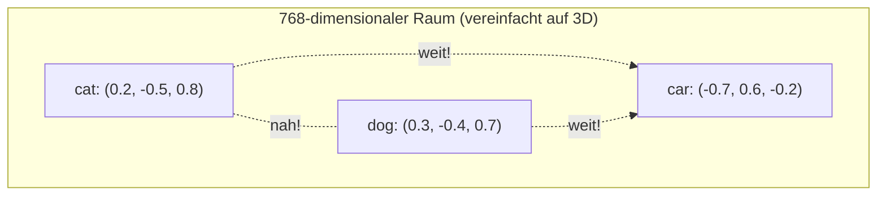

# Kapitel 3 — Embeddings: Zahlen Bedeutung geben

## Die Analogie für Fünfjährige

Stell dir vor, jedes Wort lebt in einem **riesigen Wohnhaus** mit 768 Stockwerken (Dimensionen).

- **„cat“** wohnt im 3. Stock Ost, 15. Stock Nord usw.
- **„dog“** wohnt in der Nähe — ähnliche Stockwerke, weil beide Tiere sind.
- **„car“** wohnt weit entfernt — völlig andere Stockwerke.

Jedes Wort hat eine **Koordinate** in diesem Gebäude. Wörter mit ähnlicher Bedeutung haben ähnliche Koordinaten. Genau das ist ein Embedding: **eine Koordinate für ein Wort im Bedeutungsraum.**



## Die berühmte Analogie „King - Man + Woman = Queen“

Dies ist das berühmteste Beispiel dafür, was Embeddings erfassen können:

```python
# In einem gut trainierten Embedding-Raum:
# embedding("king") - embedding("man") + embedding("woman")
# ≈ embedding("queen")
```

**Warum funktioniert das?** „king“ hat zwei Komponenten im Bedeutungsraum:
- Königlichkeit (gemeinsam mit „queen“, „prince“, „throne“)
- Männlichkeit (gemeinsam mit „man“, „he“, „boy“)

Das Subtrahieren von „man“ entfernt die Männlichkeits-Komponente. Das Addieren von „woman“ fügt Weiblichkeit hinzu. Ergebnis: ein Vektor, der „Königlichkeit + Weiblichkeit“ bedeutet = „queen.“

Das ist nicht einprogrammiert — es **entsteht auf natürliche Weise** aus der Mathematik des Trainings. Das Modell lernt, dass eine Änderung des Geschlechts bei gleichbleibender Bedeutung eine konsistente „Richtung“ im Embedding-Raum erzeugt.

## Wie Embeddings GELERNT werden

Dies ist die wichtigste Frage: „Wenn Embeddings zufällig starten, wie werden sie bedeutungsvoll?“

### Schritt 1: Zufällige Initialisierung

Wenn wir das Modell erstellen, ist jede Embedding-Zeile zufälliges Rauschen:
```
Token 9246 ("cat"): [0.002, -0.013, 0.007, ..., -0.009]   (768 Zufallszahlen)
Token 6734 ("sat"): [0.015, 0.001, -0.011, ..., 0.004]   (768 Zufallszahlen)
```

An diesem Punkt sind „cat“ und „dog“ einander **nicht näher** als „cat“ und „the.“ Das Modell weiß noch nichts.

### Schritt 2: Trainingssignal

Während des Trainings sieht das Modell: `"The cat sat on the mat"` und versucht, das nächste Wort vorherzusagen.

Wenn es bei „mat“ falsch liegt (und stattdessen „dog“ vorhersagt), ist der **Loss** hoch. Backpropagation sendet ein Signal:
- „Das Embedding für ‚cat‘ sollte so aktualisiert werden, dass es ‚mat‘ besser vorhersagt“
- „Das Embedding für ‚mat‘ sollte näher an Dingen liegen, die auf ‚the‘ folgen“

### Schritt 3: Gradient Descent aktualisiert Embeddings

```python
# Vereinfacht — was mit einem Embedding während eines Trainingsschritts passiert:

# Aktuelles Embedding für Token "cat":
cat_embedding = [0.002, -0.013, 0.007, ..., -0.009]

# Nachdem "The ___ sat on the mat" gesehen wurde (mit "cat" eingesetzt):
# Der Gradient sagt: "Dimension 5 um 0.0003 erhöhen, Dimension 42 um 0.0001 verringern..."
cat_embedding = [0.002, -0.012, 0.008, ..., -0.010]  # Kleines Update

# Nach MILLIONEN von Beispielen entstehen Muster:
# - "cat" rückt näher an "dog", "pet", "feline"
# - "cat" bleibt weit entfernt von "car", "democracy", "photosynthesis"
```

### Schritt 4: Nach dem Training — Emergente Struktur

Nach dem Training auf Milliarden von Tokens entwickelt der 768-dimensionale Raum eine bedeutungsvolle Struktur:

```
Richtung 1 (0-63):   Belebtheit — belebt vs. unbelebt
Richtung 2 (64-127): Größe — groß vs. klein  
Richtung 3 (128-191): Sentiment — positiv vs. negativ
Richtung 4 (192-255): Formalität — formell vs. informell
...
```

Diese „Richtungen“ werden nicht von Menschen zugewiesen. Sie entstehen aus der Geometrie der Sprache. Das Modell entdeckt, dass es nützlich ist, verwandte Konzepte zusammenzufassen, weil sie in ähnlichen Kontexten auftreten.

## Ein Hinweis zur Skalierung

GPT-2 und GPT-3 multiplizieren Embeddings mit `sqrt(d_model)`. Das ist
notwendig, wenn man Positional Encodings zu Embeddings ADDIERT, weil die
beiden Signale eine vergleichbare Größenordnung haben müssen. Positionswerte
aus sin/cos liegen zwischen -1 und 1, während frisch initialisierte
Embeddings deutlich kleiner sind.

Wir verwenden stattdessen RoPE. RoPE addiert keine Positionsinformation. Es
rotiert die Query- und Key-Vektoren. Rotation erhält die Vektorlänge, sodass
kein Problem entsteht, bei dem ein Signal das andere überlagert. Der
Konvention von LLaMA folgend wenden wir in unserem Code keinerlei Skalierung
auf die Embeddings an. Der Embedding-Layer schlägt den Vektor lediglich
nach und gibt ihn zurück.

```python
embeddings = self.embed(x)           # Werte sind ~N(0, 0.02) aus der Initialisierung
# Keine Skalierung nötig bei RoPE — LLaMA und Mistral skalieren Embeddings nicht
```

## Was bestimmt die Qualität von Embeddings?

| Faktor | Gute Embeddings | Schlechte Embeddings |
|---|---|---|
| Umfang der Trainingsdaten | 100B+ Tokens | 1M Tokens |
| Embedding-Dimension | 768+ (GPT-2) bis 12288 (GPT-3) | 64 oder weniger |
| Vokabulargröße | 50K (ausgewogen) | 5K (zu klein) oder 500K (zu dünn besetzt) |
| Trainingsdauer | Konvergierter Loss | Frühes Abbrechen |
| Datenvielfalt | Bücher, Web, Code, Konversation | Einzelne Domäne |

## Embedding-Code — Kommentiert

```python
import torch
import torch.nn as nn
import math


class Embedding(nn.Module):
    """
    WAS: Wandelt Token-IDs in dichte Vektoren (Embeddings) um.
    WARUM: Ein neuronales Netz kann mit ganzzahligen IDs wie [9246, 6734]
           keine sinnvolle Mathematik betreiben. Es braucht kontinuierliche Zahlen in Vektorform.

           Man kann es sich als riesige Nachschlagetabelle vorstellen:
           Zeile 9246 -> Vektor aus 768 Floats (die "Bedeutung" von "cat")
           Zeile 6734 -> Vektor aus 768 Floats (die "Bedeutung" von "sat")

           Diese Tabelle wird GELERNT. Anfangs zufällig, verschiebt
           Backpropagation nach und nach verwandte Tokens im
           768-dimensionalen Raum näher zueinander.
    """

    def __init__(self, vocab_size: int, d_model: int):
        """
        WAS: Erstellt die Embedding-Tabelle (eine lernbare Matrix).

        Args:
            vocab_size: Wie viele eindeutige Tokens es gibt (50,257 bei GPT-2)
            d_model:    Größe jedes Embedding-Vektors.

        Beispiele nach Modellgröße:
            GPT-2 small:  vocab=50257, d_model=768   → Tabelle ist 50257 × 768
            GPT-2 medium: vocab=50257, d_model=1024  → Tabelle ist 50257 × 1024
            GPT-3 small:  vocab=50257, d_model=4096  → Tabelle ist 50257 × 4096
            GPT-3 large:  vocab=50257, d_model=12288 → Tabelle ist 50257 × 12288

        WARUM: Die Embedding-Dimension bestimmt, wie viel "Raum"
               jedes Wort hat, um seine Bedeutung auszudrücken. Größeres
               d_model = feinere Bedeutungsnuancen können erfasst werden,
               auf Kosten von mehr Parametern und langsamerem Training.
        """
        super().__init__()

        # WAS: Die eigentlichen Embedding-Gewichte — eine [vocab_size, d_model]-Matrix
        # WARUM: nn.Embedding ist eine optimierte Nachschlagetabelle. Übergibt man
        #        einen Tensor von Token-IDs, liefert sie die entsprechenden Zeilen zurück.
        #        Sie wird von einer normalen Gewichtsmatrix gestützt, sodass Gradienten
        #        genauso hindurchfließen wie bei jedem nn.Linear-Layer.
        #
        #        Intern ist nn.Embedding im Wesentlichen:
        #        def forward(self, x):
        #            return self.weight[x]  # Index in die Gewichtsmatrix
        self.embed = nn.Embedding(vocab_size, d_model)

    def forward(self, x: torch.Tensor) -> torch.Tensor:
        """
        WAS: Schlägt für jede Token-ID in der Eingabe das Embedding nach.

        Input-Shape:  [batch_size, seq_len]    — jede Zelle ist eine Token-ID
        Output-Shape: [batch_size, seq_len, d_model] — jede Zelle ist ein Vektor

        Beispiel-Durchlauf:
            Input:  [[464, 3797]]              # ["The", "cat"]
            Schritt 1: Zeile 464 nachschlagen → [768 Floats] für "The"
                       Zeile 3797 nachschlagen → [768 Floats] für "cat"
            Schritt 2: Skalieren mit sqrt(768) ≈ 27.7
            Output: [[[v0..v767], [v0..v767]]] # 2 Vektoren aus je 768 Zahlen

        WARUM diese Dimensionen:
            batch_size = wie viele Sequenzen wir gleichzeitig verarbeiten (Parallelität)
            seq_len    = wie viele Tokens pro Sequenz (Context Window)
            d_model    = wie reichhaltig die Repräsentation jedes Tokens ist (Ausdruckskraft)
        """
        # WAS: Index in die Embedding-Matrix
        # WARUM: Für jede Token-ID wird deren Zeile zurückgegeben. Das ist eine
        #        O(1)-Lookup-Operation — sehr schnell, selbst bei 50K+ Vokabular.
        embeddings = self.embed(x)  # [batch, seq_len, d_model]

        # WAS: Embeddings unverändert zurückgeben
        # WARUM: Wir verwenden RoPE für die Positionskodierung. RoPE
        #        rotiert, statt zu addieren, daher ist keine Skalierung
        #        nötig. LLaMA und Mistral folgen derselben Konvention.
        return embeddings
```

## Kurzer Verständnistest

Bevor es weitergeht, überprüfe dein Verständnis:

1. **F:** Wenn „cat“ Token 9246 ist, was ist das Embedding von „cat“?
   **A:** Was auch immer in Zeile 9246 der Embedding-Matrix steht. Anfangs zufällig, nach dem Training ein 768-dimensionaler Vektor, der die „Bedeutung“ von „cat“ erfasst.

2. **F:** Warum können wir nicht direkt die rohen Token-IDs (9246, 6734 usw.) verwenden?
   **A:** Weil 9246 und 6734 einfach willkürliche Zahlen sind. Das Modell würde denken, 9246 > 6734 (eine falsche Beziehung). Embeddings ermöglichen es dem Modell zu lernen, dass „cat“ (9246) „dog“ ähnlich ist (keine benachbarte ID, aber ein benachbarter Vektor).

3. **F:** Erfassen Embeddings auch die Bedeutung von Satzzeichen?
   **A:** Ja! „.“ (Punkt), „,“ (Komma), „?“ — alle haben Embeddings. Das Modell lernt, dass auf „.“ großgeschriebene Wörter folgen, auf „?“ Antworten folgen usw.

---

**Zurück:** [Kapitel 2 — Tokenisierung](02_tokenization.md)
**Weiter:** [Kapitel 4 — Positional Encoding](04_positional_encoding.md)
