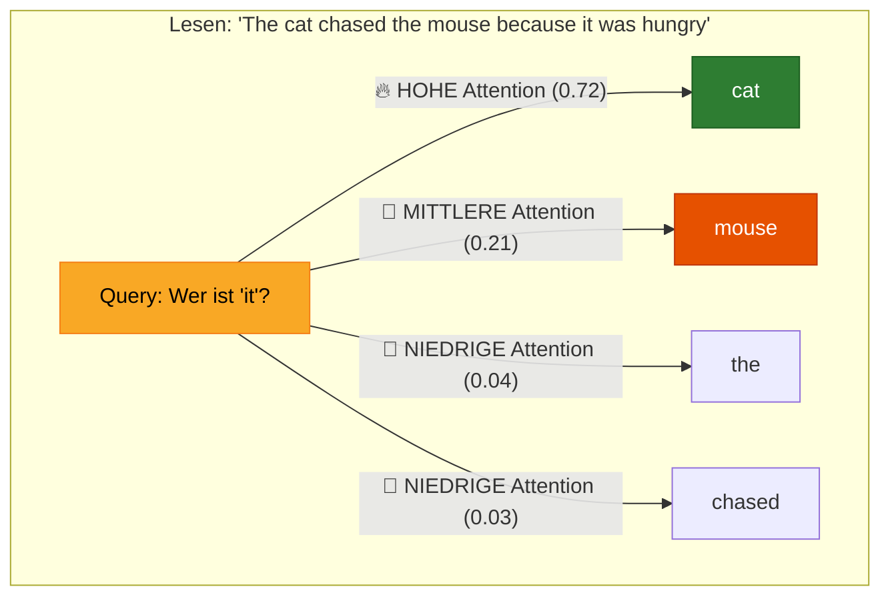
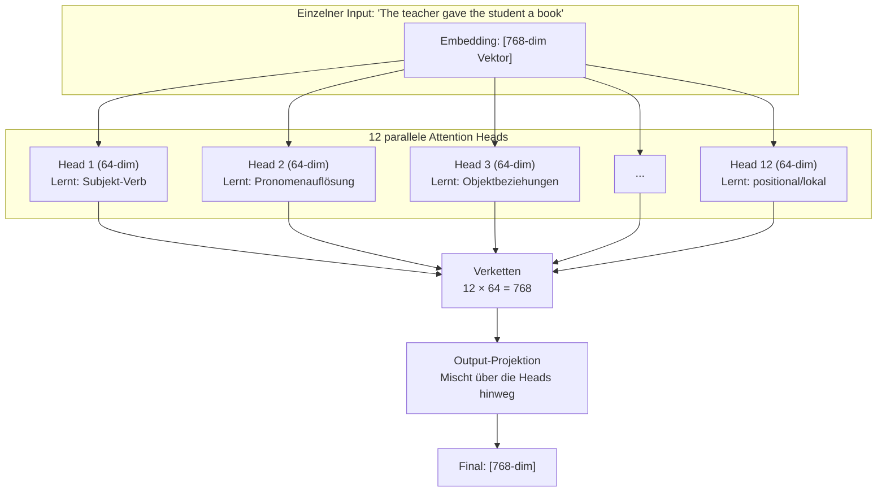
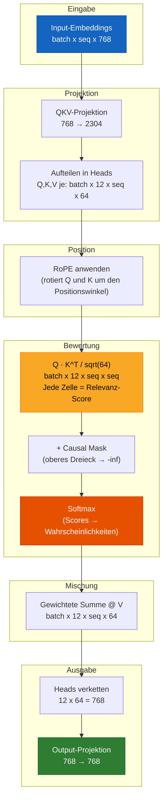

# Kapitel 5 — Attention: Die geheime Zutat

> *Attention ist nicht nur ein Teil des Transformers. Attention IST der Transformer.*

## Die Analogie für Fünfjährige

Du betrittst eine überfüllte Party. Du willst verstehen, was gerade passiert. Du hörst nicht **allen gleich aufmerksam** zu. Du schenkst **mehr Aufmerksamkeit**:

- der Person, mit der du gerade sprichst (hohe Relevanz)
- der Person, die laut ruft (hohe Wichtigkeit)
- dem Gespräch über dein Lieblingsthema (hohe Übereinstimmung mit deinen Interessen)

**Attention ist die Fähigkeit des Modells, auf ALLE Wörter zu schauen und zu entscheiden: „Wie sehr sollte mich dieses Wort GERADE JETZT interessieren?“**



---

## Teil 1: Self-Attention — Die Kernidee

### Das Problem, das damit gelöst wird

Betrachte diesen Satz: **„The cat sat on the mat because it was warm.“**

Worauf bezieht sich **„it“**? Auf die Katze? Auf die Matte? Ein Mensch weiß sofort: „it“ = „mat“ (weil Matten warm sind, Katzen dagegen warmblütig). Aber wie findet ein Computer das heraus?

**Vor Attention (RNNs, LSTMs):** Wörter wurden eines nach dem anderen verarbeitet, von links nach rechts. Als das Modell bei „it“ ankam, lag das Wort „mat“ schon weit in der Vergangenheit — seine Information war verblasst.

**Mit Attention:** Das Modell kann gleichzeitig auf ALLE vorherigen Wörter zurückblicken und entscheiden: „mat“ passt am besten zu „it“, weil „warm“ häufig mit Oberflächen/Objekten assoziiert wird.

### Was Self-Attention berechnet

Für jedes Wort in einer Sequenz erzeugt Self-Attention eine **neue Repräsentation** dieses Wortes, die eine **gewichtete Mischung aller Wörter der Sequenz** ist:

```
New("it") = 0.72 × cat + 0.21 × mouse + 0.04 × the + 0.03 × chased
```

Die Gewichte (0.72, 0.21, 0.04, 0.03) sind die **Attention Scores** — sie sagen uns, wie stark jedes Wort ins Gewicht fällt.

---

## Teil 2: Die Mathematik — Von Wörtern zu Attention Scores

### Schritt-für-Schritt-Beispiel

Gehen wir Attention anhand **realer (vereinfachter) Zahlen** durch. Wir verwenden dazu ein winziges Modell mit `d_model=4` und `num_heads=2` zur Veranschaulichung.

**Input:** Der Satz `"I love dogs"` nach Tokenisierung und Embedding:
```
Token 0 ("I"):    [0.5,  0.2, -0.3,  0.8]
Token 1 ("love"): [0.1, -0.5,  0.7, -0.2]
Token 2 ("dogs"): [0.9,  0.3, -0.1, -0.5]
```

### Schritt 1: Q, K, V aus dem Input erzeugen

Das Embedding jedes Tokens wird mit drei Gewichtsmatrizen multipliziert, um Query-, Key- und Value-Vektoren zu erzeugen:

```
Q = x × W_q    (Query: "Wonach suche ich?")
K = x × W_k    (Key:   "Was habe ich anzubieten?")
V = x × W_v    (Value: "Mein eigentlicher Inhalt/meine Information")
```

Diese Gewichtsmatrizen `W_q, W_k, W_v` werden **während des Trainings gelernt**. Anfangs zufällig, lernen sie nach und nach, Tokens in nützliche Q/K/V-Räume zu projizieren.

Nehmen wir für unser winziges Beispiel an, nach der Projektion (mit `head_dim=2`) ergibt sich:

```
Token │ Query (Q)    │ Key (K)      │ Value (V)
──────┼───────────────┼──────────────┼──────────────
 0:"I"   │ [ 0.8,  0.1] │ [ 0.6, -0.3] │ [ 0.4,  0.9]
 1:"love"│ [-0.2,  0.7] │ [ 0.1,  0.5] │ [-0.3,  0.2]
 2:"dogs"│ [ 0.5, -0.4] │ [-0.4,  0.8] │ [ 0.7, -0.1]
```

### Schritt 2: Attention Scores berechnen

Der Attention Score zwischen Token `i` (Query) und Token `j` (Key) ist das **Skalarprodukt**:

```
score(i→j) = Q_i · K_j
```

Dies misst, wie gut die Query von Token `i` zum Key von Token `j` passt. Hohes Skalarprodukt = hohe Relevanz.

**Berechnung der Scores für Token 2 ("dogs"), das auf alle Tokens schaut:**

```
score("dogs"→"I")    = Q₂ · K₀ = [0.5, -0.4] · [ 0.6, -0.3] = 0.30 + 0.12 = 0.42
score("dogs"→"love") = Q₂ · K₁ = [0.5, -0.4] · [ 0.1,  0.5] = 0.05 - 0.20 = -0.15
score("dogs"→"dogs") = Q₂ · K₂ = [0.5, -0.4] · [-0.4,  0.8] = -0.20 - 0.32 = -0.52
```

### Schritt 3: Die Scores skalieren

Teile durch `sqrt(head_dim)` = `sqrt(2)` ≈ 1.414:

```
Warum? Wenn d_k groß ist, werden die Skalarprodukte zu großen Zahlen.
Große Zahlen → softmax wird sehr "spitz" (ein Wert nahe 1.0,
der Rest nahe 0.0) → Gradienten verschwinden → das Modell lernt nicht mehr.

Skalierung hält die Varianz unabhängig von d_k bei 1.0.
```

```
Scaled scores: [0.42/1.414, -0.15/1.414, -0.52/1.414] = [0.297, -0.106, -0.368]
```

### Schritt 4: Causal Mask anwenden (nur beim Training)

Während des Trainings darf Token an Position `i` keine Tokens an Positionen `> i` sehen. Das bedeutet:

```
For token 0 ("I"):    can only see position 0
For token 1 ("love"): can only see positions 0, 1
For token 2 ("dogs"): can only see positions 0, 1, 2
```

Zukünftige Positionen werden auf `-infinity` gesetzt (sodass ihr Softmax-Wert 0 wird).

### Schritt 5: Softmax → Attention-Gewichte

Wandle die Scores in Wahrscheinlichkeiten um, die sich zu 1 summieren:

```
softmax([0.297, -0.106, -0.368]) = [0.53, 0.35, 0.12]
```

**Interpretation:** Beim Verarbeiten von „dogs“ schenkt das Modell:
- 53 % Attention „I“
- 35 % Attention „love“
- 12 % Attention „dogs“ (sich selbst)

### Schritt 6: Gewichtete Summe der Values

Multipliziere den Value-Vektor jedes Tokens mit seinem Attention-Gewicht und summiere:

```
New("dogs") = 0.53 × V("I") + 0.35 × V("love") + 0.12 × V("dogs")

            = 0.53 × [ 0.4,  0.9] + 0.35 × [-0.3,  0.2] + 0.12 × [ 0.7, -0.1]
            = [0.212, 0.477]      + [-0.105, 0.070]      + [0.084, -0.012]
            = [0.191, 0.535]
```

**Dieser neue Vektor [0.191, 0.535] ist die „kontextbewusste“ Repräsentation von „dogs“** — er enthält jetzt Information aus „I“ und „love“, gewichtet nach Relevanz.

### Die vollständige Attention-Matrix

Für unsere 3-Token-Sequenz die komplette Attention-Gewichtsmatrix:

```
         │ "I"    "love"  "dogs"  ← (keys: "what I offer")
─────────┼──────────────────────
"I"      │ 1.00   0.00    0.00    ← "I" can only see itself (causal)
"love"   │ 0.45   0.55    0.00    ← "love" sees "I" and itself
"dogs"   │ 0.53   0.35    0.12    ← "dogs" sees all three
    ↑
(queries: "what I'm looking for")
```

Dies ist das **kausale Attention-Muster** — eine untere Dreiecksmatrix, bei der jede Zeile sich zu 1.0 summiert. Jedes Token baut seine Repräsentation aus sich selbst und allen vorangehenden Tokens auf.

---

## Teil 3: Multi-Head Attention — Warum mehrere Heads?

### Die Einschränkung eines einzelnen Heads

Mit nur einem Attention Head mittelt das Modell ALLE Beziehungen zu einer einzigen Repräsentation. Sprache hat jedoch viele gleichzeitige Beziehungen:

```
"The teacher gave the student a book because she was proud of him."

Q: Who is "she"?  → teacher (gender agreement)
Q: Who is "him"?   → student (gender agreement)
Q: Who gave what?   → teacher → student → book (syntactic roles)
```

Ein einzelner Head muss alle drei Antworten in einen Vektor komprimieren — unübersichtlich, verlustbehaftet, konfus.

### Multi-Head: Teile und herrsche

Stattdessen führen wir Attention **mehrfach parallel** aus, jeweils mit eigenem `W_q, W_k, W_v`:

```
Head 1 learns: subject-verb relationships → "teacher" ↔ "gave"
Head 2 learns: pronoun resolution        → "she" ↔ "teacher"
Head 3 learns: object relationships      → "student" ↔ "book"
Head 4 learns: adjective-noun patterns   → "proud" ↔ "teacher"
...
Head 12: positional patterns, punctuation, etc.
```

Jeder Head hat die Dimension `d_model / num_heads`. Für GPT-2 small: `768 / 12 = 64` Dimensionen pro Head.



### Was Heads tatsächlich lernen (aus der Forschung)

Die Analyse trainierter GPT-2-Modelle offenbart Spezialisierungen der Heads:

- **Frühe Layer (1–3):** Lokale Syntax — benachbarte Wörter, Interpunktion, grundlegende Grammatik
- **Mittlere Layer (4–8):** Semantische Beziehungen — Subjekt-Verb, Objektbeziehungen, Entity-Tracking
- **Späte Layer (9–12):** Muster auf hoher Ebene — thematische Kohärenz, Negationsreichweite, Anapherauflösung

Manche Heads spezialisieren sich stark:
- „Duplicate-Token-Heads“: Kopieren das vorherige Token (nützlich bei Wiederholungen)
- „Inhibition-Heads“: Unterdrücken aktiv die Attention auf bestimmte Tokens
- „Position-Heads“: Achten rein auf die Distanz (Wort N Positionen entfernt)

---

## Teil 4: Der Skalierungsfaktor — ein kritisches Detail

### Warum `1/sqrt(d_k)`?

Die Attention-Formel lautet:

```
Attention(Q, K, V) = softmax(QK^T / √d_k) × V
```

Aber warum durch `√d_k` teilen? Gehen wir die Mathematik durch:

**Ohne Skalierung:** Jedes Element von `QK^T` ist das Skalarprodukt zweier Vektoren der Länge `d_k`. Wenn jedes Element von Q und K den Mittelwert 0 und die Varianz 1 hat, dann gilt:

```
Var(dot product) = d_k
```

Bei `d_k = 64` haben die Skalarprodukte also eine Varianz von 64. Standardabweichung = 8. Das bedeutet, typische Skalarprodukte liegen etwa zwischen -24 und +24.

**Problem:** Wenn Zahlen so groß sind, wird `softmax` extrem spitz — ein Wert nähert sich 1.0 an, alle anderen nähern sich 0.0 an. Der Gradient von softmax ist dann fast überall nahe null, sodass das Modell aufhört zu lernen.

**Mit Skalierung:** Nach der Division durch `√64 = 8` wird die Varianz 1.0. Skalarprodukte liegen dann etwa zwischen -3 und +3. Softmax erzeugt eine glattere Verteilung, und Gradienten fließen ordnungsgemäß.

```
Without scaling:  softmax([24, 8, -16]) = [0.99999988, 0.00000011, 0.00000000]  ← useless!
With scaling:     softmax([3, 1, -2])   = [0.88, 0.12, 0.01]                    ← useful!
```

---

## Teil 5: Causal Masking — Nicht in die Zukunft schauen

### Das Problem

Beim Training zeigen wir dem Modell: `"The cat sat on the mat"`

Die Aufgabe des Modells an Position 3 (`"on"`) ist es, `"the"` vorherzusagen. Aber wenn Position 3 auf Position 5 (`"mat"`) zugreifen könnte, könnte das Modell **schummeln** — es sieht die Antwort, bevor es sie vorhersagt!

### Die Lösung: Untere Dreiecksmaske

```
         │ pos0  pos1  pos2  pos3  pos4
─────────┼─────────────────────────────
pos0     │  ✓     ✗     ✗     ✗     ✗    "The" can only see itself
pos1     │  ✓     ✓     ✗     ✗     ✗    "cat" sees "The" and itself
pos2     │  ✓     ✓     ✓     ✗     ✗    "sat" sees first three
pos3     │  ✓     ✓     ✓     ✓     ✗    "on"  sees first four
pos4     │  ✓     ✓     ✓     ✓     ✓    "the" sees all five
```

Implementierung: Das obere Dreieck wird auf `-infinity` gesetzt → nach dem Softmax werden diese Positionen 0.0.

```python
# Vor der Mask:
attn_scores = [[0.3,  0.5,  0.2, -0.1, -0.4],  # Zeile 0
               [0.1,  0.4, -0.3,  0.6, -0.2],  # Zeile 1
               ...]

# Mask anwenden (oberes Dreieck = -inf):
attn_scores = [[0.3, -inf, -inf, -inf, -inf],  # Zeile 0: sieht nur Position 0
               [0.1,  0.4, -inf, -inf, -inf],  # Zeile 1: sieht 0,1
               [0.5, -0.2,  0.3, -inf, -inf],  # Zeile 2: sieht 0,1,2
               ...]

# Nach softmax:
attn_weights = [[1.0,  0.0,  0.0,  0.0,  0.0],  # Zeile 0: gesamtes Gewicht auf sich selbst
                [0.43, 0.57, 0.0,  0.0,  0.0],  # Zeile 1: aufgeteilt zwischen 0,1
                [0.42, 0.21, 0.37, 0.0,  0.0],  # Zeile 2: gewichtete Mischung
                ...]
```

### Zur Inferenzzeit

Während der Textgenerierung wird das Causal Masking **implizit beibehalten** — wir erzeugen Tokens nacheinander, sodass zukünftige Tokens schlicht noch nicht existieren. Das aktuelle Token kann nur auf zuvor generierte Tokens zugreifen.

---

## Teil 6: Rechenkomplexität — Das O(n²)-Problem

### Warum langer Kontext schwierig ist

Attention berechnet `Q @ K^T` und erzeugt dabei eine `[seq_len × seq_len]`-Matrix:

| Sequenzlänge | Größe der Attention-Matrix | Speicher (float32) |
|---|---|---|
| 1,024 (GPT-2) | 1,024 × 1,024 | 4 MB |
| 2,048 (GPT-3) | 2,048 × 2,048 | 16 MB |
| 8,192 (LLaMA 2) | 8,192 × 8,192 | 256 MB |
| 32,768 (GPT-4 Turbo) | 32,768 × 32,768 | 4 GB |
| 128,000 (Claude 3) | 128K × 128K | 64 GB |
| 1,000,000 (Gemini) | 1M × 1M | 4 TB |

Dieses quadratische Wachstum ist der **grundlegende Engpass** von Transformer-Modellen.

### Lösungsansätze

| Methode | Funktionsweise | Beschleunigung |
|---|---|---|
| **Flash Attention** | Optimiert Speicherzugriffsmuster, fusioniert Kernels | 2-4x |
| **Sparse Attention** | Nur auf √n Tokens achten (lokal + global) | 10-100x |
| **Sliding Window** | Nur auf die letzten W Tokens achten (Mistral) | Linear O(n) |
| **Ring Attention** | Sequenz ringförmig über GPUs verteilen | Skaliert mit GPUs |
| **Mamba/SSMs** | Ersetzt Attention vollständig durch State-Space-Modelle | Linear O(n) |

Die meisten modernen LLMs verwenden **Flash Attention** (Dao et al., 2022), das die Mathematik nicht verändert — es macht Berechnung und Speicherzugriff durch Kernel-Fusion und Tiling nur wesentlich effizienter.

---

## Teil 7: Vollständiger Multi-Head-Attention-Code

```python
import torch
import torch.nn as nn
import torch.nn.functional as F
import math


class MultiHeadAttention(nn.Module):
    """
    WAS: Multi-Head Self-Attention mit RoPE und Causal Masking.

    WARUM: Transformer wären ohne Attention nutzlos. Dies ist der Mechanismus,
         der es jedem Token erlaubt, jedes andere Token "anzuschauen" und zu
         entscheiden, wie sehr es für das Verständnis des aktuellen Kontexts zählt.

         Jeder Attention Head:
         1. Projiziert den Input in Query-, Key- und Value-Räume
         2. Berechnet Q·K^T / sqrt(d_k) → wie gut jede Query zu jedem Key passt
         3. Wendet die Causal Mask an → kein Blick in zukünftige Tokens
         4. Softmax → wandelt Scores in eine Wahrscheinlichkeitsverteilung um
         5. Gewichtete Summe der Values → baut eine kontextbewusste Repräsentation

         Dies mit mehreren Heads parallel durchzuführen erlaubt es jedem
         Head, sich auf unterschiedliche sprachliche Muster zu spezialisieren.
    """

    def __init__(self, d_model: int, num_heads: int, dropout: float = 0.1):
        """
        Args:
            d_model:   Gesamte Embedding-Dimension (z. B. 768 für GPT-2 small)
            num_heads: Anzahl paralleler Attention Heads (z. B. 12)
            dropout:   Wahrscheinlichkeit, Attention-Gewichte zufällig auf null zu setzen

        WARUM: d_model muss durch num_heads teilbar sein, weil jeder Head auf
             d_model/num_heads Dimensionen arbeitet (64 bei GPT-2 small). Diese
             Split-dann-Concat-Strategie lässt Heads sich spezialisieren und
             hält die Gesamtparameterzahl gleich wie bei einem großen Head.
        """
        super().__init__()

        # WAS: Prüfen, dass die Heads die Modell-Dimension gleichmäßig teilen
        assert d_model % num_heads == 0, (
            f"d_model ({d_model}) must be divisible by num_heads ({num_heads}). "
            f"This ensures each head has equal dimension."
        )

        self.d_model = d_model
        self.num_heads = num_heads
        self.head_dim = d_model // num_heads  # 768/12 = 64 Dimensionen pro Head
                                               # WARUM: 64 ist der "Sweet Spot" —
                                               # groß genug, um Bedeutung zu erfassen,
                                               # klein genug für effiziente Berechnung
        # ===== QKV-Projektion =====
        # WAS: Ein großer Linear-Layer, der den Input gleichzeitig auf Q, K, V projiziert
        # WARUM:  3 separate Linear(768→768)-Layer = 3 Matrixmultiplikationen.
        #       Eine kombinierte Linear(768→2304) = 1 größere Matrixmultiplikation.
        #       Auf der GPU ist 1 große Operation viel schneller als 3 kleine,
        #       dank besserer Parallelität und weniger Kernel-Starts.
        #       Shape: [d_model, 3 * d_model] = [768, 2304]
        self.qkv_proj = nn.Linear(d_model, 3 * d_model, bias=False)

        # ===== Output-Projektion =====
        # WAS: Projiziert die verketteten Head-Outputs zurück auf d_model
        # WARUM:  Nach der Verkettung: [batch, seq, d_model], aber jeder Head-Output
        #       wurde unabhängig berechnet. Dieser Linear-Layer MISCHT
        #       Information über die Heads hinweg und lässt sie kommunizieren.
        #       Ohne ihn blieben die Heads isoliert — wie 12 Experten,
        #       die nie miteinander sprechen.
        self.out_proj = nn.Linear(d_model, d_model, bias=False)

        # ===== RoPE (Rotary Position Embeddings) =====
        # WAS: Wendet rotationsbasierte Positionskodierung nur auf Q und K an
        # WARUM:  RoPE kodiert Position in die Q- und K-Vektoren, sodass
        #       das Skalarprodukt Q·K auf natürliche Weise von der RELATIVEN
        #       Position abhängt. Wir wenden es auf head_dim (nicht d_model) an,
        #       weil jeder Head seine eigene Positionsinfo in seinem Unterraum
        #       braucht.
        #       V erhält KEIN RoPE, weil Values Inhalt tragen, nicht
        #       Position — Position ist nur relevant, um zu entscheiden,
        #       WELCHEN Values Aufmerksamkeit gilt, nicht für die Values selbst.
        self.rotary = RotaryPositionalEmbedding(self.head_dim)

        # ===== Dropout =====
        # WAS: Setzt Attention-Gewichte während des Trainings zufällig auf null
        # WARUM:  Ohne Dropout kann das Modell überzuversichtlich werden —
        #       ein Token dominiert die Attention immer und ignoriert anderen
        #       potenziell nützlichen Kontext. Dropout zwingt das Modell,
        #       redundante Attention-Muster zu lernen (Rückfallpläne).
        self.attn_dropout = nn.Dropout(dropout)   # Wird auf Attention-Gewichte angewendet
        self.resid_dropout = nn.Dropout(dropout)  # Wird auf den finalen Output angewendet

    def forward(self, x: torch.Tensor, mask: torch.Tensor = None) -> torch.Tensor:
        """
        WAS: Berechnet Multi-Head Self-Attention.

        Input:  x    [batch, seq_len, d_model]  — Token-Embeddings
                mask [batch, 1, seq, seq]       — Causal Mask (1=sichtbar, 0=maskiert)

        Output:      [batch, seq_len, d_model]  — kontextbewusste Repräsentationen

        Der Forward Pass hat 8 Schritte, jeder davon kritisch:
        """
        batch_size, seq_len, _ = x.shape

        # ===== SCHRITT 1: Input auf Q, K, V projizieren — alles auf einmal =====
        # WAS: Transformiert den Input linear in Query-, Key-, Value-Räume
        # WARUM:  Die kombinierte Projektion ist auf der GPU schneller als 3 separate.
        #       Danach: [batch, seq, 3*d_model], wobei die letzte Dimension
        #       zuerst die Q-Werte, dann die K-Werte, dann die V-Werte enthält.
        qkv = self.qkv_proj(x)               # [batch, seq, 3 * d_model]

        # ===== SCHRITT 2: Umformen, um die Head-Dimension freizulegen =====
        # WAS: Teilt 3*d_model in separate Q,K,V und separate Heads auf
        # WARUM:  Wir brauchen die Shape [batch, num_heads, seq, head_dim] für
        #       parallele Berechnung. Reshape + Permute erledigt das
        #       in zwei effizienten Operationen ohne Datenkopien.
        #
        # Transform: [batch, seq, 3, heads, head_dim]
        # Then permute: [3, batch, heads, seq, head_dim]
        qkv = qkv.reshape(batch_size, seq_len, 3, self.num_heads, self.head_dim)
        qkv = qkv.permute(2, 0, 3, 1, 4)    # [3, batch, heads, seq, head_dim]

        # WAS: Die drei Projektionen entpacken
        q = qkv[0]  # Query:  [batch, heads, seq, head_dim] — "wonach ich suche"
        k = qkv[1]  # Key:    [batch, heads, seq, head_dim] — "was ich zum Abgleich anbiete"
        v = qkv[2]  # Value:  [batch, heads, seq, head_dim] — "mein eigentlicher Inhalt"

        # ===== SCHRITT 3: Rotary Position Embeddings anwenden =====
        # WAS: Rotiert Q und K um positionsabhängige Winkel
        # WARUM:  Nach der Rotation hängt das Skalarprodukt q_i · k_j von
        #       cos(i-j) und sin(i-j) ab — der RELATIVEN Distanz zwischen
        #       den Tokens i und j. Genau das wollen wir: Attention sollte
        #       sich dafür interessieren, "wie weit diese Tokens auseinanderliegen",
        #       nicht "was ihre absoluten Positionen sind".
        q = self.rotary(q, seq_len)
        k = self.rotary(k, seq_len)

        # ===== SCHRITT 4: Attention Scores berechnen (Q · K^T) =====
        # WAS: Für jedes Query-Token das Skalarprodukt mit jedem Key-Token berechnen
        # WARUM:  Das Skalarprodukt misst die Kosinus-Ähnlichkeit (bei normierten Vektoren).
        #       Höheres Skalarprodukt = die Query "will", was der Key "anbietet".
        #
        #       Shape: [batch, heads, query_seq, key_seq]
        #       attn_scores[b, h, i, j] = wie stark Token i auf Token j achtet
        #
        #       DIVISION DURCH sqrt(head_dim): entscheidend für stabiles Training.
        #       Ohne dies wächst die Varianz der Skalarprodukte mit d_k,
        #       wodurch softmax zu "spitz" wird → Gradienten verschwinden → das Modell stirbt.
        #       Siehe Teil 4 oben für die mathematische Herleitung.
        attn_scores = (q @ k.transpose(-2, -1)) / math.sqrt(self.head_dim)

        # ===== SCHRITT 5: Causal Mask anwenden — kein Blick in zukünftige Tokens =====
        # WAS: Setzt Attention Scores zu zukünftigen Tokens auf -infinity
        # WARUM:  Während des Trainings muss das Modell token[i+1] aus
        #       tokens[0..i] vorhersagen. Wenn token[i] token[i+1] sehen könnte,
        #       wäre das, als würde man die Antwort vor der Frage sehen — Schummeln.
        #
        #       -infinity → e^(-inf) = 0.0 nach softmax = keine Attention
        #
        #       Die Mask ist unteres Dreieck:
        #       Token 0 → sieht [0]        (nur sich selbst)
        #       Token 1 → sieht [0, 1]     (sich selbst + Vorheriges)
        #       Token 2 → sieht [0, 1, 2]  (sich selbst + alles Vorherige)
        #       Token 3 → sieht [0, 1, 2, 3]
        if mask is not None:
            attn_scores = attn_scores.masked_fill(mask == 0, float('-inf'))

        # ===== SCHRITT 6: Softmax — Scores werden zu Attention-Gewichten =====
        # WAS: Wandelt rohe Scores in eine Wahrscheinlichkeitsverteilung über die Keys um
        # WARUM:  softmax(scores)[j] = e^score[j] / sum(e^score[k] for k in all keys)
        #       Das macht alle Gewichte:
        #       - Positiv (e^x > 0 immer)
        #       - Summieren sich zu 1.0 (echte Wahrscheinlichkeitsverteilung)
        #       - Differenzierbar (wir können Gradienten hindurch berechnen)
        #
        #       Der Softmax wird über die LETZTE Dimension angewendet (dim=-1),
        #       das ist die "Key"-Dimension — jede Query erhält also eine
        #       Verteilung über alle Keys, die sie sehen darf.
        attn_weights = F.softmax(attn_scores, dim=-1)
        attn_weights = self.attn_dropout(attn_weights)

        # ===== SCHRITT 7: Gewichtete Summe der Values =====
        # WAS: Mischt die Value-Vektoren gemäß den Attention-Gewichten
        # WARUM:  Hier passiert die eigentliche Attention. Jedes Query-
        #       Token bekommt einen NEUEN Vektor, der eine gewichtete
        #       Mischung aller sichtbaren Value-Vektoren ist.
        #
        #       Hohe Attention auf Token j → V_j hat großen Einfluss
        #       Niedrige Attention auf Token j → V_j hat geringen Einfluss
        #
        #       Das Ergebnis ist "kontextbewusst" — jedes Token "kennt"
        #       jetzt die anderen relevanten Tokens in der Sequenz.
        #
        #       [batch, heads, seq, head_dim] @ [batch, heads, seq, head_dim]
        #       → [batch, heads, seq, head_dim]
        attn_output = attn_weights @ v

        # ===== SCHRITT 8: Heads zusammenführen und projizieren =====
        # WAS: Kombiniert alle Head-Outputs zu einem d_model-Vektor pro Token
        # WARUM:  Aktuell: [batch, heads, seq, head_dim]
        #       Benötigt:  [batch, seq, d_model]
        #
        #       Transpose vertauscht Heads und Sequenz:
        #       [batch, seq, heads, head_dim]
        #       Reshape flacht heads×head_dim ab:
        #       [batch, seq, d_model]
        #
        #       Die finale lineare Projektion lässt Information zwischen
        #       den Heads fließen — die Erkenntnisse jedes Heads können nun
        #       die kombinierte Repräsentation beeinflussen.
        attn_output = attn_output.transpose(1, 2).contiguous()
        attn_output = attn_output.reshape(batch_size, seq_len, self.d_model)

        output = self.out_proj(attn_output)   # Mischt über die Heads hinweg
        output = self.resid_dropout(output)   # Regularisierung

        return output


def create_causal_mask(seq_len: int, device: torch.device) -> torch.Tensor:
    """
    WAS: Erzeugt eine kausale (untere Dreiecks-) Attention-Mask.
    WARUM:  Verhindert, dass Tokens während des Trainings zukünftige Tokens sehen.

    Visualisierung für seq_len=6:
        [[✓, ✗, ✗, ✗, ✗, ✗],     Token 0 (erstes Wort)
         [✓, ✓, ✗, ✗, ✗, ✗],     Token 1
         [✓, ✓, ✓, ✗, ✗, ✗],     Token 2
         [✓, ✓, ✓, ✓, ✗, ✗],     Token 3
         [✓, ✓, ✓, ✓, ✓, ✗],     Token 4
         [✓, ✓, ✓, ✓, ✓, ✓]]     Token 5 (letztes Wort — sieht alles)

    ✓ = Position ist sichtbar (1.0)
    ✗ = Position ist maskiert (0.0, wird in der Attention zu -inf)

    Umgeformt zu [1, 1, seq_len, seq_len] für Broadcasting über:
    - Batch-Dimension (alle Batches verwenden dieselbe Mask)
    - Head-Dimension (alle Heads verwenden dieselbe Mask — Heads KÖNNEN nicht in die Zukunft sehen)
    """
    mask = torch.tril(torch.ones(seq_len, seq_len, device=device))
    return mask.view(1, 1, seq_len, seq_len)
```

---

## Teil 8: Was das Modell tatsächlich „sieht“

### Attention-Heatmap

Für den Satz **„The cat sat on the mat because it was comfortable“** könnte die Attention eines trainierten Modells so aussehen:

```
         The  cat  sat  on  the  mat  because  it  was  comfortable
The      ████ ░░░░ ░░░░ ░░░░ ░░░░ ░░░░ ░░░░      ░░░░ ░░░░ ░░░░
cat      ████ ████ ░░░░ ░░░░ ░░░░ ░░░░ ░░░░      ░░░░ ░░░░ ░░░░
sat      ░░░░ ████ ████ ░░░░ ░░░░ ░░░░ ░░░░      ░░░░ ░░░░ ░░░░
on       ░░░░ ░░░░ ████ ████ ░░░░ ░░░░ ░░░░      ░░░░ ░░░░ ░░░░
the      ░░░░ ░░░░ ░░░░ ████ ████ ░░░░ ░░░░      ░░░░ ░░░░ ░░░░
mat      ░░░░ ░░░░ ░░░░ ░░░░ ████ ████ ░░░░      ░░░░ ░░░░ ░░░░
because  ░░░░ ░░░░ ░░░░ ░░░░ ░░░░ ████ ████      ░░░░ ░░░░ ░░░░
it       ░░░░ ░░░░ ░░░░ ░░░░ ░░░░ ████ ░░░░      ████ ░░░░ ░░░░
was      ░░░░ ░░░░ ░░░░ ░░░░ ░░░░ ░░░░ ████      ████ ████ ░░░░
comfort. ░░░░ ░░░░ ░░░░ ░░░░ ░░░░ ░░░░ ░░░░      ░░░░ ████ ████
                                         ↑
                        „it“ schenkt „mat“ starke Aufmerksamkeit
                        (löst die Pronomenreferenz auf)
```

Es fallen zwei Muster auf:
1. **Starke Diagonale** — jedes Wort achtet stark auf sich selbst (man braucht immer die eigene Bedeutung)
2. **Pronomenauflösung** — „it“ achtet auf „mat“ (das Modell hat den Referenten korrekt identifiziert)
3. **Kausale Struktur** — nur unteres linkes Dreieck, oben rechts steht überall null

---

## Teil 9: Attention-Varianten (über unsere Implementierung hinaus)

| Variante | Was sie tut | Verwendet von |
|---|---|---|
| **Self-Attention** | Q, K, V stammen alle aus demselben Input (dieser Code) | Alle GPT-Modelle |
| **Cross-Attention** | Q vom Decoder, K,V vom Encoder | Original-Transformer, T5 |
| **Grouped Query Attention** | Weniger KV-Heads als Q-Heads | LLaMA 2 70B, Mistral |
| **Multi-Query Attention** | Ein einziger KV-Head, geteilt über alle Q-Heads | PaLM, Gemini |
| **Flash Attention** | Fusionierte CUDA-Kernels für O(n²)-Beschleunigung | Die meisten Produktions-LLMs |
| **Sliding Window** | Achtet nur auf die letzten W Tokens | Mistral 7B |
| **Sparse Attention** | Kombination aus lokalen und gestreuten (strided) Mustern | Longformer, BigBird |

---

## Attention-Flussdiagramm



---

## Zusammenfassung: Die Attention-Checkliste

Für jedes Token an Position `i` gilt, Attention:

- [x] Erzeugt eine **Query** („Wonach suche ich?“)
- [x] Erzeugt einen **Key** für jedes Token („Was biete ich an?“)
- [x] Erzeugt einen **Value** für jedes Token („Mein eigentlicher Inhalt“)
- [x] Berechnet **Q_i · K_j** für alle sichtbaren Tokens j ≤ i
- [x] Skaliert mit **1/√d_k** (verhindert verschwindende Gradienten)
- [x] Maskiert zukünftige Tokens (j > i → -inf)
- [x] Wendet **Softmax** an (wandelt in Wahrscheinlichkeitsverteilung um)
- [x] Berechnet die **gewichtete Summe der Values** (kontextbewusste Repräsentation)
- [x] Tut dies **parallel für mehrere Heads** (unterschiedliche sprachliche Muster)
- [x] Verkettet die Heads und projiziert sie zurück auf **d_model**
- [x] Fügt **Dropout** zur Regularisierung hinzu
- [x] Gibt den Output über eine **Residual Connection** zurück (wird vom TransformerBlock übernommen)

---

**Zurück:** [Kapitel 4 — Positional Encoding](04_positional_encoding.md)
**Weiter:** [Kapitel 6 — Transformer Block](06_transformer_block.md)
