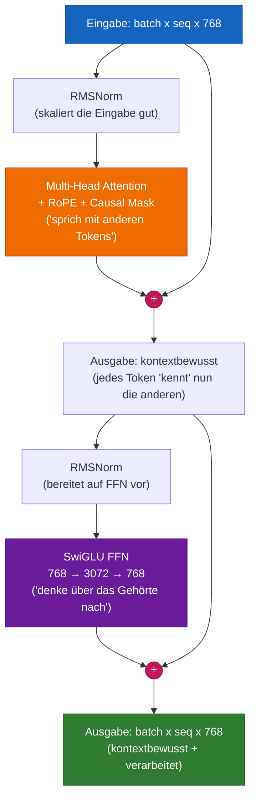

# Kapitel 6 — Der Transformer-Block

## Die Analogie für Fünfjährige

Ein Transformer-Block ist wie ein **Sandwich**:

```
RMSNorm         (bereitet die Eingabe vor — macht sie "sauber" und gut skaliert)
  Attention     (das Fleisch — "sprich mit allen anderen Wörtern und sammle Kontext")
  + Residual    (Skip-Connection — "behalte auch die ursprüngliche Bedeutung")
RMSNorm         (bereitet erneut vor)
  SwiGLU FFN    (der Käse — "denke allein über das nach, was du gerade gehört hast")
  + Residual    (Skip-Connection — "behalte, was du hattest, füge neue Erkenntnis hinzu")
```

Jedes moderne LLM stapelt 12-96 dieser Sandwiches übereinander.

## Die beiden Sub-Layer erklärt

### Sub-Layer 1: Attention — „Sprich mit allen“

```
Eingabe:  "The cat sat on the mat"
                              ^
Für Token "mat": schaue auf "The", "cat", "sat", "on", "the", "mat"
                 Entscheide: "sat" ist am relevantesten (Verb-Subjekt)
                             "the" ist am zweitrelevantesten (Artikel-Nomen)
                 Mische ihre Bedeutungen zu einer neuen "mat"-Repräsentation
```

### Sub-Layer 2: Feed-Forward — „Denke für dich allein“

```
Nach Attention: jedes Token hat eine kontextbewusste Repräsentation
Jetzt FFN: verarbeite JEDES Token unabhängig mit denselben Gewichten
         (wie das alleinige Durcharbeiten deiner Notizen nach einer Gruppendiskussion)

Warum nötig? Attention mischt Informationen ZWISCHEN Tokens.
            FFN verarbeitet Informationen INNERHALB jedes Tokens.
            Beide sind für tiefes Verständnis notwendig.
```

### Warum kann Attention nicht alles erledigen?

Eine häufige Frage: Wenn Attention alle Tokens betrachten kann, wozu brauchen wir dann das FFN?

**Antwort:** Attention ist eine LINEARE Operation (gewichtete Summe von Values). Das FFN ist NICHT-LINEAR (besitzt Aktivierungsfunktionen). Ohne das FFN wären zusätzlich gestapelte Attention-Layer nur weitere lineare Kombinationen — nicht leistungsfähiger als ein einzelner Attention-Layer. Die Nicht-Linearität des FFN (SiLU-Aktivierung) verleiht dem Transformer seine Fähigkeit zur universellen Funktionsapproximation.

```
Attention:  output = Σ(attention_weights × values)    ← lineare Kombination
FFN:        output = W3(SiLU(W1 × x) × (W2 × x))     ← nicht-lineare Transformation
```

## Die Residual Connection — der „Gradient-Highway“

### Was sie bewirkt

```
Ohne Residual:  output = SubLayer(input)
Mit Residual:   output = input + SubLayer(Norm(input))
```

### Warum sie entscheidend ist: das Vanishing-Gradient-Problem

In einem 12-Layer-Netzwerk ohne Residuals ist das Gradientensignal in Layer 1:

```
gradient_at_layer_1 = gradient_at_layer_12 × (weight_12 × weight_11 × ... × weight_2)
```

Wenn jedes Gewicht 0.5 beträgt (realistisch für den Trainingsbeginn), dann:
```
gradient_at_layer_1 = gradient_at_layer_12 × 0.5^11
                    = gradient_at_layer_12 × 0.0005  ← fast NULL!
```

Das bedeutet, dass frühe Layer fast kein Lernsignal erhalten — sie bleiben zufällig, das Modell lernt nie.

**Mit Residuals:**

```
Mit Residual:  output = input + SubLayer(input)
```

Der Gradient hat nun ZWEI Pfade:
1. Durch den Sublayer: `∂(SubLayer) / ∂(input)` — kann klein sein
2. Durch den Skip: `∂(input) / ∂(input) = 1.0` — immer exakt 1.0!

Der Gesamtgradient ist `1.0 + small_number` — verschwindet nie.

**Analogie:** Stell dir vor, du fährst vom 12. Stock in den 1. Stock. Ohne Residuals musst du 11 Treppen nehmen (jede Treppe = eine Gewichtsmultiplikation). Mit Residuals gibt es eine Feuerwehrstange (Skip-Connection), die direkt nach unten führt — der Gradient fließt sofort, unabhängig davon, was die Sublayer tun.

## Pre-Norm vs. Post-Norm: eine entscheidende Design-Entscheidung

| Aspekt | Post-Norm (Original-Paper) | Pre-Norm (modern) |
|---|---|---|
| Formel | `Norm(x + SubLayer(x))` | `x + SubLayer(Norm(x))` |
| Trainingsstabilität | Anfangs instabil, benötigt sorgfältige LR | Stabil ab Schritt 1 |
| Gradientenfluss | Normalisiert NACH der Addition | Unnormalisierter Residual-Pfad |
| Verwendet von | Original-Transformer (2017) | GPT-3, LLaMA, PaLM, alle modernen |
| Tiefe Netzwerke | Scheitert bei > 12 Layern | Funktioniert bei 100+ Layern |

**Warum Pre-Norm besser funktioniert:** Der Residual-Pfad (`+ x`) bleibt unnormalisiert, was für einen sauberen Gradientenfluss sorgt. Post-Norm normalisiert die Ausgabe, was in tiefen Netzwerken Gradienten stauchen kann.

## Moderne Verbesserungen

| Komponente | Alter Ansatz | Moderner Ansatz | Warum besser |
|---|---|---|---|
| Normalisierung | LayerNorm | **RMSNorm** | 15% schneller, gleich effektiv, kein Zentrieren nötig |
| Aktivierung | ReLU/GELU | **SwiGLU** | Gate-Mechanismus lernt, welche Infos behalten/verworfen werden |
| Norm-Position | Post-Norm | **Pre-Norm** | Stabiles Training bei jeder Tiefe |

## RMSNorm — genauere Erklärung

### LayerNorm vs. RMSNorm

```
LayerNorm(x) = ((x - mean(x)) / std(x)) * γ + β
               ^^^^^^^^^^^^^^^^^^^^^^^^^^    ^^^^
               zentrieren UND skalieren      lernbare Verschiebung und Skalierung

RMSNorm(x)  = (x / rms(x)) * γ
               ^^^^^^^^^^^^    ^^
               nur skalieren   nur lernbare Skalierung (keine Verschiebung, keine Division durch std)
```

RMSNorm verzichtet auf:
1. **Mittelwertsubtraktion** (Zentrierung) — als unnötig erkannt, kostet zusätzliche Rechenzeit
2. **Bias-Parameter β** — als unnötig erkannt, die Residual Connection übernimmt diese Funktion
3. **Standardabweichung** — verwendet stattdessen RMS (Wurzel aus dem Mittel der Quadrate, einfacher zu berechnen)

Ergebnis: mathematisch einfacher, ~15% schneller, in der Praxis gleiche Leistung.

### Warum überhaupt normalisieren?

Ohne Normalisierung können die Ausgaben von Attention und FFN unbegrenzt wachsen. Nach 12 Layern könnten Werte das 100x oder 0.01x ihrer ursprünglichen Größenordnung betragen — was zu numerischer Instabilität führt. Normalisierung hält die Ausgabe jedes Layers auf einer konsistenten Skala.

## RMSNorm-Code

```python
import torch
import torch.nn as nn


class RMSNorm(nn.Module):
    """
    WAS: Root Mean Square Layer Normalization.
    WARUM: Normalisiert die Repräsentation jedes Tokens, sodass ihre Magnitude ~1.0 beträgt.
           Verhindert, dass Werte über tiefe Netzwerke hinweg wachsen/schrumpfen.

           Verwendet in: LLaMA 1/2/3, Mistral, Gemma, Qwen
    """

    def __init__(self, d_model: int, eps: float = 1e-6):
        super().__init__()
        # WAS: Lernbare Skalierung pro Dimension
        # WARUM: Nachdem RMS=1 erzwungen wurde, kann das Modell lernen,
        #        wichtige Dimensionen zu verstärken und unwichtige zu dämpfen.
        #        Startet bei 1.0 (anfangs keine Veränderung).
        self.weight = nn.Parameter(torch.ones(d_model))
        self.eps = eps  # WARUM: verhindert Division durch Null

    def forward(self, x: torch.Tensor) -> torch.Tensor:
        # WAS: Berechnet 1/sqrt(mean(x²))
        # WARUM: rsqrt ist 1/sqrt — wird als einzelner CUDA-Kernel
        #        berechnet, für Geschwindigkeit. Der Mittelwert wird über
        #        die letzte Dimension (d_model) gebildet.
        #        keepdim=True erhält die Dimension für Broadcasting.
        rms = torch.rsqrt(x.pow(2).mean(-1, keepdim=True) + self.eps)

        # WAS: Normalisieren, dann lernbar skalieren
        return x * rms * self.weight
```

## SwiGLU-Code

```python
import torch
import torch.nn as nn
import torch.nn.functional as F


class SwiGLU(nn.Module):
    """
    WAS: SwiGLU — gegatete Version der Swish-Aktivierung.
    WARUM: Das "Gate" (rechte Seite der Multiplikation) lernt,
           Informationen selektiv durchzulassen oder zu blockieren — wie ein Wasserhahn.

           Standard-FFN:  output = W2(ReLU(W1(x)))
           SwiGLU-FFN:    output = W3(SiLU(W1(x)) * (W2(x)))
                                     ^^^^^^^^      ^^^^^^
                                     Values        Gate

           Das Gate multipliziert die Values: wenn Gate ≈ 0, blockiere Info.
                                        wenn Gate ≈ 1, lasse Info durch.
                                        wenn Gate ≈ 0.5, teilweiser Durchlass.

           Dieser Gating-Mechanismus ist es, der SwiGLU besser als
           ReLU und GELU macht — das Modell lernt, WO es Nicht-Linearität anwendet.

           Paper: "GLU Variants Improve Transformer" (Shazeer, 2020)
           Verwendet in: LLaMA 1/2/3, PaLM, Gemini
    """

    def __init__(self, d_model: int, expansion_factor: int = 4):
        super().__init__()

        # WAS: Hidden-Dim ist 4x Input/Output — der "Expansion"-Engpass
        # WARUM: Expandieren→Verarbeiten→Komprimieren ist ausdrucksstärker als gleiche Größe.
        #        784 → 3072 → 784 lässt das FFN ~4x komplexere Muster lernen.
        hidden_dim = expansion_factor * d_model

        self.w1 = nn.Linear(d_model, hidden_dim, bias=False)   # Projiziert auf Values
        self.w2 = nn.Linear(d_model, hidden_dim, bias=False)   # Projiziert auf Gates
        self.w3 = nn.Linear(hidden_dim, d_model, bias=False)   # Projiziert zurück

    def forward(self, x: torch.Tensor) -> torch.Tensor:
        # WAS: SiLU(w1(x)) sind die Values, w2(x) sind die Gates
        # WARUM: SiLU (auch Swish genannt) = x * sigmoid(x)
        #        Es ist glatt (im Gegensatz zu ReLU, das bei 0 eine scharfe Ecke hat),
        #        was Gradienten während des Trainings besser fließen lässt.
        #        Das Gate multipliziert die Values elementweise und lässt Info selektiv durch.
        return self.w3(F.silu(self.w1(x)) * self.w2(x))
```

## Vollständiger Transformer-Block-Code

```python
import torch
import torch.nn as nn


class TransformerBlock(nn.Module):
    """
    WAS: Ein vollständiger Transformer-Layer (Attention + FFN mit Residuals).
    WARUM: Stapel N davon, um ein tiefes Sprachmodell zu bauen.

           Architektur (Pre-Norm):
           ┌─────────────────────────────────────┐
           │ x = x + Attention(RMSNorm(x), mask) │  ← Mischt Informationen ZWISCHEN Tokens
           │ x = x + SwiGLU(RMSNorm(x))          │  ← Verarbeitet Informationen INNERHALB von Tokens
           └─────────────────────────────────────┘

           Jeder Sublayer: zuerst normalisieren (Pre-Norm), dann berechnen,
           dann das Original zurück ADDIEREN (Residual Connection).

           Ohne Residuals: tiefe Netzwerke lassen sich nicht trainieren (Vanishing Gradients)
           Ohne Pre-Norm: das Training ist bei großer Tiefe instabil
           Ohne FFN: keine nicht-lineare Verarbeitung pro Token
           Ohne Attention: keine Informationsmischung zwischen Tokens
    """

    def __init__(self, d_model: int, num_heads: int, dropout: float = 0.1):
        super().__init__()

        # WAS: Erste Normalisierung — vor der Attention
        # WARUM: Pre-Norm: saubere, gut skalierte Eingabe → stabile Attention-Berechnung
        self.norm1 = RMSNorm(d_model)

        # WAS: Multi-Head-Self-Attention mit RoPE und Causal Masking
        # WARUM: Der zentrale Mechanismus, der Tokens erlaubt, "miteinander zu sprechen"
        self.attention = MultiHeadAttention(d_model, num_heads, dropout)

        # WAS: Zweite Normalisierung — vor dem FFN
        # WARUM: Das FFN erwartet normalisierte Eingaben für konsistentes Verhalten über alle Layer
        self.norm2 = RMSNorm(d_model)

        # WAS: SwiGLU-Feed-Forward-Netzwerk
        # WARUM: Nicht-lineare Verarbeitung pro Token. Ohne dies wären zusätzlich
        #        gestapelte Attention-Layer nicht leistungsfähiger als ein einzelner Layer.
        self.ffn = SwiGLU(d_model)

    def forward(self, x: torch.Tensor, mask: torch.Tensor = None) -> torch.Tensor:
        """
        Forward Pass: Norm → Sublayer → Residual addieren.
        Wird zweimal ausgeführt: einmal für Attention, einmal für FFN.
        """

        # ===== SUB-LAYER 1: Self-Attention mit Residual =====
        # WAS: x = x + Attention(Norm(x))
        # WARUM: Das Modell lernt, welche ÄNDERUNGEN (das Delta) an x vorzunehmen sind,
        #        nicht, wodurch x vollständig ersetzt werden soll. Das ist leichter zu lernen.
        #        Wenn Attention nichts verbessern kann, kann sie nahezu Null ausgeben.
        x = x + self.attention(self.norm1(x), mask)

        # ===== SUB-LAYER 2: Feed-Forward mit Residual =====
        # WAS: x = x + FFN(Norm(x))
        # WARUM: Gleiches Residual-Muster. Nach dem Mischen von Informationen via Attention
        #        "denkt" jedes Token unabhängig über das FFN nach.
        #        Attention = Gruppendiskussion. FFN = private Reflexion.
        x = x + self.ffn(self.norm2(x))

        return x
```

## Architektur-Diagramm



---

**Vorheriges Kapitel:** [Kapitel 5 — Attention](05_attention.md)
**Nächstes Kapitel:** [Kapitel 7 — Das vollständige GPT](07_gpt_model.md)
