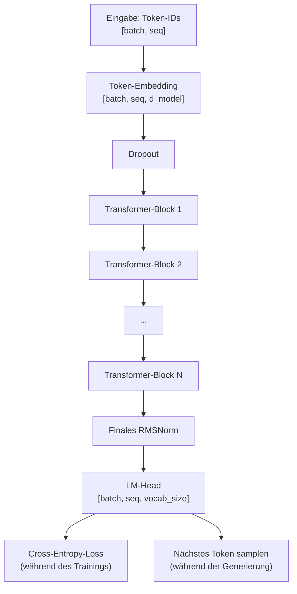

# Kapitel 7 — Das vollständige GPT-Modell

## Was wir bauen

Nach 6 Kapiteln voller Bausteine setzen wir sie nun zu einem **vollständigen Sprachmodell** zusammen. Dies ist im Wesentlichen dieselbe Architektur wie LLaMA 3, Mistral und Qwen 2.5 — nur verkleinert, damit sie auf deine GPU passt.



## Die Config — das „Rezept“ deines Modells

```python
from dataclasses import dataclass


@dataclass
class GPTConfig:
    """
    WAS: Alle Hyperparameter an einem Ort.
    WARUM: Die Modellgröße zu ändern ist eine Zeile. Kein Suchen im Code.
    """
    # ===== Architektur =====
    vocab_size: int = 50257        # WAS: 50.257 einzigartige Token im GPT-2-Vokabular
    d_model: int = 768             # WAS: Jedes Token wird zu einem 768-dim Vektor
                                   # WARUM: Größer = nuanciertere Bedeutungen, mehr Rechenaufwand
    num_heads: int = 12            # WAS: 12 Attention Heads (12 × 64 = 768)
    num_layers: int = 12           # WAS: 12 gestapelte Transformer-Blöcke
                                   # WARUM: Tiefer = besseres Schlussfolgern, schwerer zu trainieren
    max_seq_len: int = 1024        # WAS: Maximale Anzahl Token, die das Modell auf einmal verarbeiten kann

    # ===== Regularisierung (verhindert Overfitting) =====
    dropout: float = 0.1           # WAS: Deaktiviert während des Trainings zufällig 10 % der Neuronen
    embd_dropout: float = 0.1      # WAS: Dropout, das direkt nach dem Embedding-Lookup angewendet wird

    # ===== Training =====
    learning_rate: float = 3e-4    # WAS: Schrittgröße für die Gewichtsupdates
    weight_decay: float = 0.1      # WAS: Bestraft große Gewichte (L2-Regularisierung)
    warmup_steps: int = 2000       # WAS: Erhöht die Learning Rate für die ersten 2000 Steps schrittweise
    max_steps: int = 100000        # WAS: Gesamtzahl der Trainingsiterationen
    batch_size: int = 8            # WAS: Pro GPU-Step verarbeitete Sequenzen
    grad_accum_steps: int = 4      # WAS: Akkumuliert Gradient-Steps (effektive Batch Size = 8×4 = 32)
    betas: tuple = (0.9, 0.95)    # WAS: AdamW-Momentum-Koeffizienten
    eps: float = 1e-8              # WAS: Kleine Konstante, die eine Division durch Null verhindert

    def __post_init__(self):
        """Prüft die Konsistenz der Konfiguration."""
        assert self.d_model % self.num_heads == 0, (
            f"d_model ({self.d_model}) must be divisible by "
            f"num_heads ({self.num_heads})"
        )
```

## Das vollständige GPT-Modell

```python
import torch
import torch.nn as nn
import torch.nn.functional as F


class GPT(nn.Module):
    """
    WAS: Ein vollständiges Decoder-only-Transformer-Sprachmodell.
    WARUM: Diese einzelne Klasse vereint alles, was wir gebaut haben:
           Embedding → N× Transformer-Blöcke → Ausgabeprojektion.

           "Decoder-only" bedeutet, dass das Modell Text von links nach
           rechts generiert (kausal/autoregressiv), ohne einen Encoder,
           der die gesamte Sequenz betrachten würde.

           Dies ist dieselbe Architekturfamilie wie:
           GPT-2 (12 Layer, 768 Dimensionen), GPT-3 (96 Layer, 12288 Dimensionen),
           LLaMA 3 (32-80 Layer), Mistral (32 Layer)
    """

    def __init__(self, config: GPTConfig):
        super().__init__()
        self.config = config

        # ===== 1. TOKEN-EMBEDDING =====
        # WAS: Lookup-Tabelle: Token-ID → dichter Vektor
        # WARUM: Wandelt Integer (IDs) in die kontinuierlichen Vektoren
        #        um, mit denen neuronale Netze arbeiten können.
        #        Shape: [50257, 768] — eine Zeile pro Vokabular-Token
        self.token_embedding = nn.Embedding(config.vocab_size, config.d_model)

        # WAS: Dropout, das auf die Embeddings angewendet wird
        # WARUM: Frühes Dropout verhindert, dass das Modell während
        #        des Trainings auf bestimmte Embedding-Werte overfittet
        self.embd_dropout = nn.Dropout(config.embd_dropout)

        # ===== 2. TRANSFORMER-BLÖCKE =====
        # WAS: Stapel aus N identischen Transformer-Layern
        # WARUM: nn.ModuleList registriert jeden Block, sodass PyTorch
        #        deren Parameter fürs Training erfasst. Eine normale
        #        Python-Liste würde NICHT erfasst werden!
        #
        #        Jeder Block: RMSNorm → Attention(+Residual) → RMSNorm → FFN(+Residual)
        self.layers = nn.ModuleList([
            TransformerBlock(
                d_model=config.d_model,
                num_heads=config.num_heads,
                dropout=config.dropout
            )
            for _ in range(config.num_layers)
        ])

        # ===== 3. FINALE NORMALISIERUNG =====
        # WAS: Ein letztes RMSNorm vor dem Output-Head
        # WARUM: Die Ausgabe des letzten Transformer-Blocks ist roh
        #        (unnormalisiert). Wir normalisieren vor der Projektion
        #        auf das Vokabular, damit der LM-Head saubere, gut
        #        skalierte Eingaben erhält.
        self.final_norm = RMSNorm(config.d_model)

        # ===== 4. LM-HEAD (Ausgabeprojektion) =====
        # WAS: Lineare Projektion: d_model → vocab_size
        # WARUM: Wandelt das 768-dim "Verständnis" jedes Tokens in
        #        einen 50257-dim Score-Vektor um — ein Score pro
        #        möglichem nächsten Token.
        #
        #        logits[b, t, v] = "Score dafür, dass Token v das
        #                           nächste Wort nach Position t in
        #                           Batch b ist"
        self.lm_head = nn.Linear(config.d_model, config.vocab_size, bias=False)

        # ===== 5. WEIGHT TYING =====
        # WAS: Gewichtsmatrix zwischen Embedding und LM-Head teilen
        # WARUM: Das Embedding bildet Token → Vektor ab. Der LM-Head
        #        bildet Vektor → Token ab. Das sind INVERSE Operationen!
        #
        #        Das Teilen der Gewichte hat drei Vorteile:
        #        1. Parameter-Effizienz: spart 50257×768 = 38,6M Parameter
        #           (30 % der Gesamtzahl bei GPT-2 small!)
        #        2. Bessere Regularisierung: Die geteilte Matrix erhält
        #           Gradientensignale aus beiden Richtungen, was die
        #           Qualität der Token-Repräsentationen verbessert
        #        3. Theoretische Eleganz: Eingabe- und Ausgabe-Token
        #           leben im selben semantischen Raum
        #
        #        Funktionsweise: self.lm_head.weight wird so gesetzt,
        #        dass es auf DENSELBEN Tensor wie self.token_embedding.weight
        #        zeigt — PyTorch nutzt so für beide denselben Speicher.
        self.token_embedding.weight = self.lm_head.weight

        # ===== 6. GEWICHTSINITIALISIERUNG =====
        # WAS: Initialisiert alle Gewichte mit Normal(0, 0.02)
        # WARUM: Mit der richtigen Verteilung zu starten ist entscheidend.
        #        Zu klein → Gradienten verschwinden, Modell lernt nie.
        #        Zu groß → Aktivierungen sättigen, Gradienten explodieren.
        #        Eine Standardabweichung von 0,02 liefert Werte meist im
        #        Bereich [-0,04, 0,04], was für Transformer der Sweet Spot ist.
        self.apply(self._init_weights)
        print(f"GPT initialized with {self.get_num_params():,} parameters")

    def _init_weights(self, module: nn.Module):
        """Initialisiert Gewichte nach dem GPT-2-Schema."""
        if isinstance(module, nn.Linear):
            torch.nn.init.normal_(module.weight, mean=0.0, std=0.02)
            if module.bias is not None:
                torch.nn.init.zeros_(module.bias)
        elif isinstance(module, nn.Embedding):
            torch.nn.init.normal_(module.weight, mean=0.0, std=0.02)

    def get_num_params(self) -> int:
        """Zählt alle trainierbaren Parameter (Gewichte + Biases)."""
        return sum(p.numel() for p in self.parameters())

    def forward(
        self,
        input_ids: torch.Tensor,
        targets: torch.Tensor = None
    ) -> tuple:
        """
        WAS: Verarbeitet einen Batch von Token-Sequenzen durch das GPT-Modell.

        Args:
            input_ids: [batch_size, seq_len] — Token-IDs für jede Sequenz
            targets:   [batch_size, seq_len] — dieselben Token, für den Loss verwendet
                       (das Modell sagt input_ids[t+1] aus input_ids[t] vorher)

        Returns:
            logits: [batch, seq_len, vocab_size] — rohe Vorhersage-Scores
            loss:   Skalar — Cross-Entropy (None, falls targets nicht angegeben)

        Der Shift-by-One-Trick:
            Input:  [The,  cat,  sat,  on,   the,  mat]
                     ↓     ↓     ↓     ↓     ↓     ↓
            Target: [cat,  sat,  on,   the,  mat,  ?]
            Predict: P(cat|The) P(sat|The,cat) ... P(mat|The,cat,sat,on,the)

Der Datensatz liefert die verschobenen Targets bereits, daher berechnen wir den Loss über alle Positionen.
        """
        batch_size, seq_len = input_ids.shape

        # ===== 1. TOKEN EMBEDDEN =====
        # Input:  [batch, seq] Token-IDs
        # Output: [batch, seq, d_model] kontinuierliche Vektoren
        x = self.token_embedding(input_ids)
        x = self.embd_dropout(x)

        # ===== 2. CAUSAL MASK ERSTELLEN =====
        # WAS: Untere Dreiecksmatrix als Maske: Token i sieht nur Token 0..i
        # WARUM: Ohne diese Maske würde das Modell "schummeln", indem es
        #        bei der Vorhersage des nächsten Tokens zukünftige Token
        #        betrachtet.
        mask = create_causal_mask(seq_len, input_ids.device)

        # ===== 3. TRANSFORMER-LAYER =====
        # WAS: Läuft nacheinander durch alle N Transformer-Blöcke
        # WARUM: Jeder Layer verfeinert die Repräsentationen. Frühe
        #        Layer erfassen Syntax. Spätere Layer erfassen Semantik.
        for layer in self.layers:
            x = layer(x, mask)

        # ===== 4. FINALE NORMALISIERUNG =====
        x = self.final_norm(x)

        # ===== 5. AUF VOKABULAR PROJIZIEREN =====
        # WAS: Wandelt das d_model-dim "Verständnis" in vocab_size-dim Scores um
        # WARUM: Jede Position erhält einen Score für jedes mögliche
        #        nächste Token.
        #
        # Beispiel: logits[0, 3, 2603] = 9.2 bedeutet:
        #   "Für Batch 0, Position 3 ist der Score für Token 2603 ('mat') 9.2"
        #   Höherer Score = Modell hält dieses Token für wahrscheinlicher.
        logits = self.lm_head(x)  # [batch, seq_len, vocab_size]

        # ===== 6. LOSS BERECHNEN (nur beim Training) =====
        loss = None
        if targets is not None:
            # WAS: Richtet Vorhersagen mittels Shift-by-One an den Targets aus
            #
            # logits[:, :-1, :]:  Vorhersagen für die Positionen 0..seq-2
            # targets[:, 1:]:      wahre Token für die Positionen 1..seq-1
            #
            #          Position:  0      1      2      3
            #          Input:     The    cat    sat    on
            #          Target:    cat    sat    on     the
            #          Logits:   P(cat) P(sat) P(on)  P(the)
            #                                        ^
            #                                   Das lassen wir weg
            #                                   (kein Target dafür)
            logits_flat = logits.contiguous().view(
                -1, self.config.vocab_size
            )
            targets_flat = targets.contiguous().view(
                -1
            )
                cumulative_probs = torch.cumsum(
                    F.softmax(sorted_logits, dim=-1), dim=-1
                )
                # Entfernt Token, nachdem die kumulative Wahrscheinlichkeit top_p überschreitet
                sorted_indices_to_remove = cumulative_probs > top_p
                # Nach rechts verschieben: das erste Token immer behalten
                sorted_indices_to_remove[:, 1:] = (
                    sorted_indices_to_remove[:, :-1].clone()
                )
                sorted_indices_to_remove[:, 0] = False
                # Zurück in die ursprüngliche Reihenfolge scattern
                indices_to_remove = sorted_indices_to_remove.scatter(
                    1, sorted_indices, sorted_indices_to_remove
                )
                logits[indices_to_remove] = float('-inf')

            # ===== NÄCHSTES TOKEN SAMPLEN =====
            # WAS: Wandelt Logits → Wahrscheinlichkeiten um → wählt ein Token
            probs = F.softmax(logits, dim=-1)
            next_token = torch.multinomial(probs, num_samples=1)

            # ===== AN SEQUENZ ANHÄNGEN =====
            input_ids = torch.cat([input_ids, next_token], dim=1)

        return input_ids
```

## nn.Parameter vs. register_buffer vs. reguläres Attribut

Das ist eine häufige Verwechslung. Hier die endgültige Übersicht:

| Typ | Erstellt durch | Vom Optimizer erfasst? | Im state_dict gespeichert? | Wird von .to(device) verschoben? |
|---|---|---|---|---|
| `nn.Parameter` | `nn.Parameter(tensor)` | Ja | Ja | Ja |
| `register_buffer` | `self.register_buffer("name", t)` | Nein | Ja | Ja |
| Reguläres Attribut | `self.x = tensor` | Nein | Nein | Nein |

Unser Modell verwendet:
- **nn.Parameter**: Alle Gewichte (nn.Linear, nn.Embedding erzeugen diese automatisch)
- **register_buffer**: RoPEs cos/sin-Caches (nicht gelernt, müssen aber auf die GPU verschoben werden)
- **Regulär**: Config-Objekt (kein Tensor, braucht keine GPU)

## Wie Logits tatsächlich aussehen

```python
# Nach dem Forward-Pass haben die Logits die Shape [batch=1, seq=6, vocab=50257]:
logits[0, 5, :]  # Vorhersagen für Position 5 (sagt Token 6 vorher)
# = Array aus 50257 Zahlen, etwa so:
# [0.1, -0.3, 0.7, ..., 9.2, ..., -2.1]
#  ^^^^  ^^^^  ^^^^       ^^^^       ^^^^
#  "the" "a"   "an"       "mat"      "xyzzy"

# Nach Softmax: Wahrscheinlichkeiten, die sich zu 1.0 summieren
probs = softmax(logits[0, 5, :])
# [0.0001, 0.0001, 0.0003, ..., 0.45, ..., 0.0000]
#                              ^^^^
#                          "mat" hat 45 % Wahrscheinlichkeit

# Top-Vorhersagen des Modells für Position 5:
top5_indices = torch.topk(logits[0, 5, :], 5).indices
# → [2603, 4521, 1234, 8901, 345]  (Token-IDs)
# → ["mat", "rug", "floor", "table", "chair"]
```

---

**Zurück:** [Kapitel 6 — Transformer-Block](06_transformer_block.md)
**Weiter:** [Kapitel 8 — Trainings-Pipeline](08_training.md)
