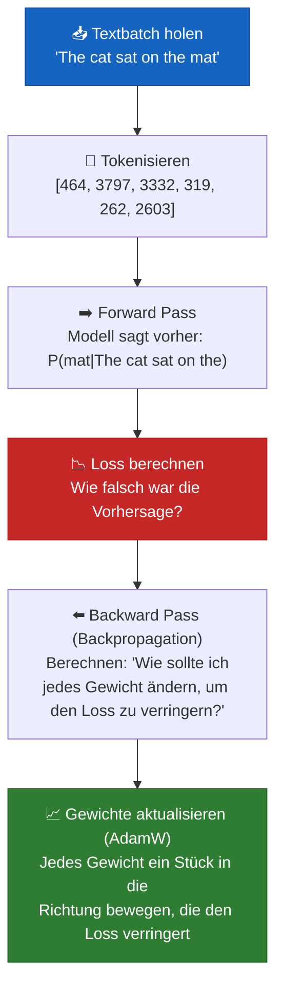

# Kapitel 8 — Die Trainings-Pipeline

## Was ist "Training" — wirklich?

Ein Sprachmodell zu trainieren ist wie einem Kind das Lesen beizubringen:

1. Zeig ihm einen Satz: "The cat sat on the ___"
2. Bitte es, das fehlende Wort zu erraten
3. Rät es richtig → gut gemacht, keine Änderung nötig
4. Rät es falsch → korrigiere es, es passt sein Verständnis leicht an
5. Wiederhole das millionenfach mit Millionen von Sätzen

Mathematisch gesehen ist das **Gradientenabstieg**: Das Modell macht eine Vorhersage, misst, wie falsch sie war (Loss), und passt dann seine 124 Millionen Parameter leicht an, um beim nächsten Mal weniger falsch zu liegen.

## Die Trainingsschleife — Visualisierung



## Cross-Entropy Loss — Die Mathematik

### Was der Loss tatsächlich misst

Gegeben die Vorhersage des Modells für das nächste Wort:

```
Tatsächliches nächstes Wort: "mat" (Token-ID 2603)

Vorhergesagte Wahrscheinlichkeiten des Modells:
  "mat":   0.45  ← Modell denkt: 45% Wahrscheinlichkeit für "mat"
  "rug":   0.30  ← 30% Wahrscheinlichkeit für "rug"
  "floor": 0.15  ← 15% Wahrscheinlichkeit
  "table": 0.07  ← 7% Wahrscheinlichkeit
  "dog":   0.03  ← 3% Wahrscheinlichkeit für etwas Zufälliges
```

**Cross-Entropy Loss** für diese Vorhersage:
```
loss = -log(P("mat")) = -log(0.45) = 0.799
```

Wenn das Modell sicherer gewesen wäre:
```
P("mat") = 0.95  →  loss = -log(0.95) = 0.051  ← viel besser!
```

Wenn das Modell falsch und dabei selbstsicher gewesen wäre:
```
P("mat") = 0.01  →  loss = -log(0.01) = 4.605  ← schrecklich!
```

### Die vollständige Cross-Entropy-Formel

Für eine einzelne Vorhersage mit wahrer Klasse `y` und vorhergesagten Wahrscheinlichkeiten `p`:
```
Loss = -log(p_y)
```

Für einen Batch von `N` Vorhersagen:
```
Loss = -(1/N) Σ log(p_y_true)
```

Genau das berechnet `F.cross_entropy(logits, targets)`. Es:
1. Wendet Softmax an, um Logits in Wahrscheinlichkeiten umzuwandeln
2. Bildet den negativen Logarithmus der Wahrscheinlichkeit der korrekten Klasse
3. Mittelt über alle Token im Batch

### Warum -log? Warum nicht einfach die Fehlerrate?

| Ansatz | Formel | Gradientensignal |
|---|---|---|
| Fehlerrate | 1 wenn falsch, 0 wenn richtig | Kein Gradient — nicht optimierbar |
| -log(p) | -log(0.45) = 0.80 | Glatter Gradient — leicht zu optimieren |
| -(1-p) | -(1-0.45) = -0.55 | Schwächeres Signal bei selbstsicheren falschen Antworten |

`-log(p)` hat eine besondere Eigenschaft: Der Gradient wird STÄRKER, je falscher wir liegen. Bei `p=0.01` ist der Gradient 100-mal größer als bei `p=0.99`. Das bedeutet, das Modell lernt am schnellsten aus seinen größten Fehlern.

## Backpropagation — Einfach erklärt

"Das Modell ist eine riesige mathematische Funktion mit 124 Millionen Reglern. Wir wollen herausfinden, in welche Richtung wir jeden Regler drehen müssen, damit der Loss kleiner wird."

### Die Kettenregel-Analogie

Stell dir vor, du backst und der Kuchen wird zu süß. Du musst den Zucker reduzieren. Aber du weißt nicht, wie stark eine Reduzierung des Zuckers um 1 Gramm die Süße beeinflusst. Und du weißt nicht, wie stark eine Verringerung der Süße um 1 Einheit den "Kuchen-Qualitätswert" beeinflusst.

```
∂(Qualität)     ∂(Qualität)     ∂(Süße)
───────────  =  ───────────  ×  ─────────
 ∂(Zucker)        ∂(Süße)        ∂(Zucker)
  
  "Wie stark        "Wie stark      "Wie stark
   beeinflusst       beeinflusst     beeinflusst
   der Zucker        die Süße        der Zucker
   die Qualität?"    die Qualität?"  die Süße?"
```

Backpropagation wendet diese Kettenregel **rückwärts durch das gesamte Modell** an — vom Loss über jede Schicht zurück bis zu den Embeddings — und berechnet dabei, wie stark jeder Parameter zum Fehler beigetragen hat.

### Ohne Analysis: Eine intuitive Betrachtung

```python
# Stell dir vor, das steht in der Trainingsschleife:
loss = F.cross_entropy(predictions, targets)  # "Wie falsch lagen wir?"
loss.backward()                                 # "Herausfinden, WARUM wir falsch lagen"

# Nach backward() hat jeder Parameter jetzt ein .grad-Attribut:
print(model.token_embedding.weight.grad[9246, 42])
# → 0.000342  "Wenn wir das Embedding cat[42] um 0.001 erhöhen,
#              sinkt der Loss um 0.000342"
```

## Gradientenabstieg mit AdamW

### Einfacher Gradientenabstieg

```
weight = weight - learning_rate × gradient
```

Das ist wie: "Wenn der Gradient sagt 'geh nach links', mach einen kleinen Schritt nach links."

### AdamW — Drei Verbesserungen

1. **Momentum (β₁ = 0.9):** Merkt sich die RICHTUNG. Wie ein Ball, der einen Hügel hinunterrollt — er baut Geschwindigkeit auf. Das glättet verrauschte Gradienten.

2. **Adaptive Learning Rate (β₂ = 0.95):** Jeder Parameter bekommt seine eigene Lernrate, basierend darauf, wie stark er sich bisher bewegt hat. Parameter, die sich selten ändern, bekommen größere Schritte. Parameter, die hin- und herspringen, bekommen kleinere Schritte.

3. **Decoupled Weight Decay:** Schrumpft Gewichte direkt in Richtung null (verhindert, dass sie zu groß werden). Im Gegensatz zu gewöhnlichem Adam ist das von der Gradientenskalierung getrennt.

```
AdamW-Update-Schritt:
  momentum       = β₁ × old_momentum + (1-β₁) × gradient
  velocity       = β₂ × old_velocity + (1-β₂) × gradient²
  corrected_m    = momentum / (1 - β₁^t)     (Bias-Korrektur)
  corrected_v    = velocity / (1 - β₂^t)     (Bias-Korrektur)
  weight         = weight (1 - lr × weight_decay)  (entkoppelt!)
  weight         = weight - lr × corrected_m / (√corrected_v + ε)
```

## Mixed Precision Training

### Float32 vs. BFloat16 vs. Float16

| Format | Bits | Exponent | Mantisse | Bereich | Genauigkeit |
|---|---|---|---|---|---|
| Float32 | 32 | 8 | 23 | ±3.4 × 10³⁸ | 7 Dezimalstellen |
| Float16 | 16 | 5 | 10 | ±65,504 | 3 Dezimalstellen |
| **BFloat16** | 16 | 8 | 7 | ±3.4 × 10³⁸ | 2 Dezimalstellen |

**Warum BFloat16:** Gleicher Wertebereich wie float32 (kein Overflow!), aber nur halb so viel Speicher und 2x schnellere Matrixmultiplikationen. Weniger Präzision als float16, aber neuronale Netze brauchen keine hohe Präzision — sie sind robust gegenüber Rundung.

**Unser Ansatz:** Forward Pass in bfloat16 (schnell), Master-Gewichte in float32 behalten (präzise Updates).

```python
# autocast-Kontext: verwendet automatisch bfloat16, wo es sicher ist
with torch.amp.autocast(device.type, enabled=use_amp):
    _, loss = model(input_ids, targets=target_ids)

# scaler übernimmt das Loss-Scaling für float16, für bfloat16 auf modernen GPUs nicht nötig
# aber der Kompatibilität halber trotzdem enthalten
scaler.scale(loss).backward()
scaler.step(optimizer)
```

## Gradient Accumulation

**Problem:** Du willst eine effektive Batch Size von 32, aber auf die GPU passt nur eine Batch Size von 4.

**Lösung:** Führe 4 Forward Passes mit batch=4 aus, akkumuliere die Gradienten (summiere sie) und mache dann EINEN Optimizer-Schritt. Das ist mathematisch äquivalent zu batch=32.

```python
# Anstatt:
for batch_32 in data:  # Passt nicht ins GPU-Memory!
    loss = model(batch_32)
    loss.backward()
    optimizer.step()

# Machen wir:
for i in range(4):
    loss = model(batch_4)           # batch_4 passt ins Memory
    (loss / 4).backward()           # Skalierung: jeder Batch trägt 1/4 bei
                                    # Gradient AKKUMULIERT sich in den .grad-Attributen
optimizer.step()                    # Ein Update für alle 4 Mini-Batches
optimizer.zero_grad()              # Reset für den nächsten Akkumulationszyklus
```

## Overfitting — Das Modell "lernt auswendig"

**Wie es aussieht:** Der Trainings-Loss sinkt weiter, aber der generierte Text wird schlechter — repetitiv, unsinnig oder er kopiert Trainingsdaten wortwörtlich.

**Warum es passiert:** Das Modell merkt sich die Trainingsdaten, anstatt allgemeine Sprachmuster zu lernen.

**Wie wir es verhindern:**
| Technik | Wie sie hilft |
|---|---|
| **Dropout (0.1)** | Deaktiviert während des Trainings zufällig 10% der Neuronen — erzwingt Redundanz |
| **Weight Decay (0.1)** | Hält die Gewichte klein — große Gewichte → Auswendiglernen |
| **Großes, vielfältiges Dataset** | Mehr Daten → schwerer, sich alles zu merken |
| **Early Stopping** | Training stoppen, wenn sich der Validation Loss nicht mehr verbessert |
| **Gradient Clipping** | Verhindert, dass einzelne Beispiele die Gewichtsupdates dominieren |

## Vollständiger Trainingscode

### Dataset

```python
import torch
from torch.utils.data import Dataset


class TextDataset(Dataset):
    """
    WAS: Bereitet Textdaten auf, indem sie in Trainings-Chunks aufgeteilt werden.
    WARUM: Das Modell lernt, das nächste Token vorherzusagen. Jeder Chunk
           liefert Input-Target-Paare für die Next-Token-Prediction.

           Jedes Sample: input[t] und target[t+1] für alle Positionen t.
           Das nennt man "Teacher Forcing" — wir zeigen während des
           Trainings für jede Position die richtige Antwort.
    """

    def __init__(self, texts: list[str], tokenizer, max_seq_len: int = 1024):
        self.tokenizer = tokenizer
        self.max_seq_len = max_seq_len

        # ===== Alle Texte mit EOS-Trennzeichen aneinanderhängen =====
        # WARUM: EOS verhindert, dass das Modell falsche Verbindungen
        #        zwischen unabhängigen Dokumenten lernt.
        all_tokens = []
        for text in texts:
            tokens = tokenizer.encode(text)
            all_tokens.extend(tokens)
            all_tokens.append(tokenizer.eos_token_id)  # Markierung der Dokumentgrenze

        self.tokens = torch.tensor(all_tokens, dtype=torch.long)
        print(f"Total tokens in dataset: {len(self.tokens):,}")

    def __len__(self) -> int:
        """Anzahl der Chunks. Jeder verwendet max_seq_len+1 Token."""
        return (len(self.tokens) - 1) // self.max_seq_len

    def __getitem__(self, idx: int) -> tuple:
        """
        Gibt (input_ids, target_ids) für einen Chunk zurück.
        Target ist um 1 Position verschoben:

        tokens:    [The,  cat,  sat,  on,   the,  mat,  EOS,  The,  dog,  ...]
        idx=0:     [The,  cat,  sat,  on,   the]     ← input_ids
                   [cat,  sat,  on,   the,  mat]     ← target_ids (verschoben)
        """
        start = idx * self.max_seq_len
        end = start + self.max_seq_len
        input_ids = self.tokens[start:end]
        target_ids = self.tokens[start + 1 : end + 1]
        return input_ids, target_ids
```

### Daten laden

```python
from datasets import load_dataset


def load_training_data(max_samples: int = None):
    """Lädt WikiText-103 herunter — sauberer Wikipedia-Text."""
    print("Loading dataset: wikitext-103-raw-v1...")
    dataset = load_dataset("Salesforce/wikitext", "wikitext-103-raw-v1", split="train")
    texts = [item["text"] for item in dataset if item["text"].strip()]
    if max_samples:
        texts = texts[:max_samples]
    print(f"Loaded {len(texts):,} documents")
    return texts
```

### LR Scheduler

```python
import math


class CosineWarmupScheduler:
    """
    WAS: Dreiphasiger Learning-Rate-Schedule.
    WARUM: Warmup verhindert frühe Instabilität. Cosine Decay sorgt
           für einen glatten Konvergenzverlauf. Die Mindestgrenze
           verhindert eine Lernrate von null.

    Phase 1 (Warmup):    LR: 0 → max_lr  (linearer Anstieg über warmup_steps)
    Phase 2 (Decay):     LR: max_lr → min_lr (Cosinus-Kurve)
    Phase 3 (Minimum):   LR: min_lr (konstant)
    """
    def __init__(self, optimizer, warmup_steps, max_steps, max_lr=3e-4, min_lr=1e-5):
        self.optimizer = optimizer
        self.warmup_steps = warmup_steps
        self.max_steps = max_steps
        self.max_lr = max_lr
        self.min_lr = min_lr
        self.current_step = 0

    def get_lr(self) -> float:
        step = self.current_step
        if step < self.warmup_steps:
            return self.max_lr * step / self.warmup_steps
        if step < self.max_steps:
            progress = (step - self.warmup_steps) / (self.max_steps - self.warmup_steps)
            cosine_decay = 0.5 * (1.0 + math.cos(math.pi * progress))
            return self.min_lr + (self.max_lr - self.min_lr) * cosine_decay
        return self.min_lr

    def step(self):
        lr = self.get_lr()
        for param_group in self.optimizer.param_groups:
            param_group["lr"] = lr
        self.current_step += 1

    def state_dict(self):
        return {"current_step": self.current_step}

    def load_state_dict(self, state_dict):
        self.current_step = state_dict["current_step"]
```

### Optimizer

```python
def create_optimizer(model, config):
    """
    WAS: AdamW mit zwei Parametergruppen (mit/ohne Weight Decay).
    WARUM: Norm-Layer und Biases sollten KEINEN Weight Decay bekommen —
           er würde sie Richtung null drücken und die Normalisierung zerstören.

    Gruppe 1 (weight_decay > 0): Linear-Gewichte, Embeddings
    Gruppe 2 (weight_decay = 0): Biases, RMSNorm, LayerNorm
    """
    decay_params = []
    no_decay_params = []

    for name, param in model.named_parameters():
        if not param.requires_grad:
            continue
        if param.dim() <= 1 or "norm" in name.lower() or "bias" in name:
            no_decay_params.append(param)
        else:
            decay_params.append(param)

    return torch.optim.AdamW(
        [
            {"params": decay_params, "weight_decay": config.weight_decay},
            {"params": no_decay_params, "weight_decay": 0.0},
        ],
        lr=config.learning_rate,
        betas=config.betas,
        eps=config.eps,
    )
```

### Die Trainingsschleife

```python
import torch
import time
import os


def train(model, train_dataset, config, device, save_dir="checkpoints"):
    """
    WAS: Die Haupt-Trainingsschleife.
    WARUM: Iteriert: Forward → Backward → Update, mit regelmäßigem Logging und Speichern.
    """
    os.makedirs(save_dir, exist_ok=True)
    model = model.to(device)
    model.train()

    dataloader = torch.utils.data.DataLoader(
        train_dataset, batch_size=config.batch_size,
        shuffle=True, drop_last=True, num_workers=4, pin_memory=True,
    )

    optimizer = create_optimizer(model, config)
    scheduler = CosineWarmupScheduler(
        optimizer, warmup_steps=config.warmup_steps,
        max_steps=config.max_steps, max_lr=config.learning_rate,
    )

    use_amp = device.type != "cpu"
    scaler = torch.amp.GradScaler(device.type, enabled=use_amp) if use_amp else None

    step = 0
    total_loss = 0.0
    loss_history = []
    best_loss = float("inf")
    start_time = time.time()

    print(f"\n{'='*60}")
    print(f"Training! Params: {model.get_num_params():,} | Device: {device}")
    print(f"Effective batch: {config.batch_size * config.grad_accum_steps}")
    print(f"{'='*60}\n")

    while step < config.max_steps:
        for batch_idx, (input_ids, target_ids) in enumerate(dataloader):
            if step >= config.max_steps:
                break

            input_ids = input_ids.to(device, non_blocking=True)
            target_ids = target_ids.to(device, non_blocking=True)

            # ===== FORWARD: Nächste Token vorhersagen, Fehler messen =====
            with torch.amp.autocast(device.type, enabled=use_amp):
                _, loss = model(input_ids, targets=target_ids)
            loss = loss / config.grad_accum_steps

            # ===== BACKWARD: Berechnen, wie verbessert werden kann =====
            if scaler:
                scaler.scale(loss).backward()
            else:
                loss.backward()

            total_loss += loss.item() * config.grad_accum_steps

            # ===== UPDATE: Alle grad_accum_steps optimieren =====
            if (batch_idx + 1) % config.grad_accum_steps == 0:
                if scaler:
                    scaler.unscale_(optimizer)
                torch.nn.utils.clip_grad_norm_(model.parameters(), max_norm=1.0)

                if scaler:
                    scaler.step(optimizer); scaler.update()
                else:
                    optimizer.step()

                optimizer.zero_grad()
                scheduler.step()
                step += 1

                # Logging alle 100 Schritte
                if step % 100 == 0 or step == 1:
                    avg_loss = total_loss / (100 if step > 0 else 1)
                    elapsed = time.time() - start_time
                    tps = (step * config.batch_size * config.grad_accum_steps
                           * config.max_seq_len) / elapsed
                    print(f"Step {step:>6,}/{config.max_steps:,} | "
                          f"Loss: {avg_loss:.4f} | LR: {scheduler.get_lr():.2e} | "
                          f"Toks/sec: {tps:,.0f}")
                    loss_history.append((step, avg_loss))
                    total_loss = 0.0

                # Checkpoint alle 5000 Schritte speichern
                if step % 5000 == 0:
                    checkpoint = {
                        "step": step, "model_state_dict": model.state_dict(),
                        "optimizer_state_dict": optimizer.state_dict(),
                        "scheduler_state_dict": scheduler.state_dict(),
                        "loss": avg_loss, "config": config,
                    }
                    torch.save(checkpoint, f"{save_dir}/checkpoint_step_{step}.pt")
                    print(f"   Saved checkpoint at step {step}")
                    if avg_loss < best_loss:
                        best_loss = avg_loss
                        torch.save(checkpoint, f"{save_dir}/best_model.pt")

    total_time = time.time() - start_time
    print(f"\n{'='*60}")
    print(f"Done! {total_time/60:.1f} min | Best loss: {best_loss:.4f}")
    print(f"{'='*60}\n")
    return loss_history


def plot_loss(loss_history, save_path="loss_curve.png"):
    """
    WAS: Visualisiert den Trainingsfortschritt.
    WARUM: Loss-Kurven helfen bei der Diagnose von Problemen:
           ↘ Stetiger Rückgang: Training funktioniert
           → Flache Linie: stagniert (höhere LR, Daten prüfen)
           ↗ Anstieg: Overfitting (mehr Dropout, Weight Decay)
           ⚡ Ausreißer: instabil (niedrigere LR, längeres Warmup)
    """
    import matplotlib.pyplot as plt
    steps, losses = zip(*loss_history)
    plt.figure(figsize=(10, 5))
    plt.plot(steps, losses)
    plt.xlabel("Training Step"); plt.ylabel("Loss")
    plt.title("GPT Training Loss")
    plt.grid(True, alpha=0.3)
    plt.tight_layout(); plt.savefig(save_path, dpi=150); plt.close()
    print(f"Loss curve saved to {save_path}")
```

---

**Vorheriges Kapitel:** [Kapitel 7 — GPT-Modell](07_gpt_model.md)
**Nächstes Kapitel:** [Kapitel 9 — Inference](09_inference.md)
