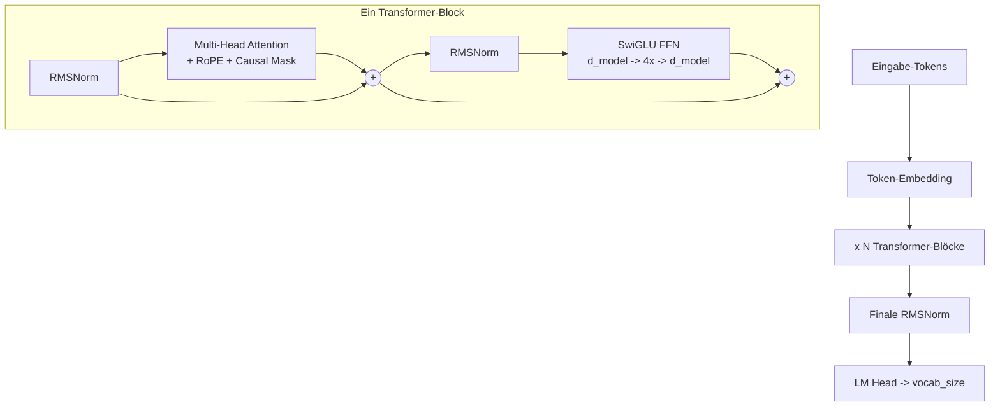

# Kapitel 11 — Glossar moderner Techniken

## Vollständiges Architekturdiagramm



## Zusammenfassung der Techniken

| Technik | Alte Methode | Moderne Methode | Warum besser |
|---|---|---|---|
| **Positionscodierung** | Gelernt (GPT-2) oder sinusförmig | **RoPE** (LLaMA, Mistral) | Relative Positionen, beliebige Länge |
| **Normalisierung** | LayerNorm | **RMSNorm** (LLaMA) | ~15 % schneller, gleich effektiv |
| **Aktivierung** | ReLU oder GELU | **SwiGLU** (PaLM, LLaMA) | Skaliert besser |
| **Norm-Position** | Post-Norm (nach dem Sublayer) | **Pre-Norm** (GPT-3, LLaMA) | Deutlich stabileres Training |
| **Optimizer** | SGD oder Adam | **AdamW** (entkoppelter Weight Decay) | Bessere Generalisierung |
| **LR-Schedule** | Konstant oder Step | **Cosinus mit Warmup** | Glattere Konvergenz |
| **Präzision** | Float32 | **bfloat16 (Mixed Precision)** | 2x schneller, halber Speicherbedarf |
| **Gradient Clipping** | Keine oder Ad-hoc | **Max-Norm 1.0** | Verhindert Gradientenexplosion |
| **Weight-Initialisierung** | Xavier uniform | **Normal(0, 0.02)** | Standard der GPT-Familie |
| **Weight Tying** | Separates Embedding & Output | **Shared Weights** | Weniger Parameter, mehr Signal |
| **Trainingsziel** | Masked LM (BERT) | **Vorhersage des nächsten Tokens** | Ermöglicht Textgenerierung |

## Aufschlüsselung der Parameteranzahl

Für unser 151M-Modell (im LLaMA-Stil mit SwiGLU):

```
Token-Embedding:  vocab_size x d_model = 50,257 x 768 = 38,597,376

Pro Transformer-Block (12 insgesamt):
  Attention QKV:   3 x 768 x 768 = 1,769,472
  Attention Out:   768 x 768     =   589,824
  SwiGLU w1:       768 x 3072    = 2,359,296
  SwiGLU w2:       768 x 3072    = 2,359,296
  SwiGLU w3:       3072 x 768    = 2,359,296
  RMSNorm x2:      768 + 768     =     1,536
  Gesamt/Block:                 = 9,438,720

12 Blöcke:  12 x 9,438,720      = 113,264,640

Finale RMSNorm:                =       768
LM Head: geteilt mit Embedding =         0 (Weight Tying!)

Gesamtsumme: 38,597,376 + 113,264,640 + 768 = 151,862,784 Parameter

Zum Vergleich: Ein Standard-GPT-2 (ohne SwiGLU, mit GELU-FFN)
hätte ~124M Parameter. SwiGLU fügt etwa 28M zusätzliche Parameter
hinzu, indem es 2 FFN-Gewichtsmatrizen durch 3 gegatete ersetzt.
```

## Was du gebaut hast

Indem du dieser Anleitung gefolgt bist, hast du einen **Decoder-only-Transformer im LLaMA-Stil** gebaut — unter Verwendung der besten öffentlich dokumentierten Techniken:

- Einen **BPE-Tokenizer** (derselbe Algorithmus wie bei GPT-2/3/4)
- Einen **Transformer** mit modernen Verbesserungen:
  - Multi-Head Attention + **RoPE**-Positionscodierung (LLaMA, Mistral, Qwen)
  - **RMSNorm**-Normalisierung (LLaMA, Mistral, Gemma)
  - **SwiGLU**-Aktivierung (PaLM, LLaMA, Gemini)
  - **Pre-Norm**-Residual-Connections (GPT-3, alle modernen Modelle)
  - **Weight Tying** zwischen Embedding und Output (GPT-2/3)
  - **Causal Masking** für autoregressives Training (alle Modelle der GPT-Familie)
- Eine **vollständige Trainings-Pipeline**:
  - AdamW + entkoppelter Weight Decay
  - Cosinus-LR-Schedule mit Warmup
  - Gradient Accumulation
  - Mixed Precision (bfloat16)
  - Gradient Clipping
  - Checkpointing
- Eine **Inference-Engine** mit:
  - Temperature Scaling
  - Top-K- und Top-P-Sampling

## Nächste Schritte

| Experiment | Was zu ändern ist | Was du lernst |
|---|---|---|
| Größeres Modell | Layer, d_model erhöhen | Wie Skalierung die Qualität verbessert |
| Mehr Daten | Vollständiges WikiText + BookCorpus | Einfluss der Datenqualität |
| Flash Attention | Durch flash_attn ersetzen | 2-5x schneller, längerer Kontext |
| Grouped Query Attention | KV-Heads reduzieren | Effiziente Inference |
| LoRA-Fine-Tuning | Low-Rank-Adapter hinzufügen | Fine-Tuning ohne vollständiges Training |
| KV-Cache | Key-Value-Paare cachen | 100x schnellere Generierung |
| Mixture of Experts | Tokens durch Experts routen | Wie GPT-4 skaliert |

## Architektur-Herkunftstabelle

| Technik | GPT-2 (2019) | GPT-3 (2020) | LLaMA (2023) | LLaMA 3 / Mistral / Qwen 2.5 (2024-25) | GPT-4 / Claude |
|---|---|---|---|---|---|
| Decoder-only | Ja | Ja | Ja | Ja | Wahrscheinlich |
| Gelernte Position | Ja | Ja | Nein | Nein | Unbekannt |
| **RoPE** | Nein | Nein | Ja | Ja | Unbekannt |
| LayerNorm | Ja | Ja | Nein | Nein | Unbekannt |
| **RMSNorm** | Nein | Nein | Ja | Ja | Unbekannt |
| GELU | Ja | Ja | Nein | Nein | Unbekannt |
| **SwiGLU** | Nein | Nein | Ja | Ja | Unbekannt |
| Pre-Norm | Nein | Ja | Ja | Ja | Wahrscheinlich |
| Weight Tying | Ja | Wahrscheinlich | Ja | Ja | Unbekannt |
| AdamW | Nein | Ja | Ja | Ja | Wahrscheinlich |

> **Fazit:** Diese Anleitung vermittelt die **LLaMA 3 / Mistral / Qwen 2.5-Architektur** — den Stand der Technik, der **öffentlich dokumentiert** ist. GPT-4 und Claude verwenden möglicherweise ähnliche oder andere Techniken; wir wissen es schlicht nicht. Aber jedes oben aufgeführte Modell baut auf demselben Transformer-Fundament auf — wer diese Architektur versteht, versteht damit die Kernprinzipien hinter ALLEN modernen LLMs.

---

**Zurück:** [Kapitel 10 — Vollständiges Skript](10_full_script.md)
**Von vorn beginnen:** [Kapitel 0 — Überblick](00_overview.md)
